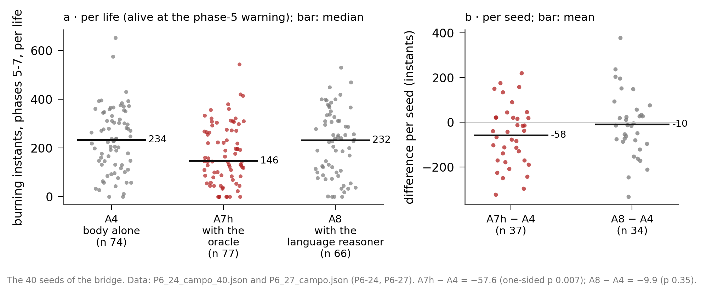

# G-EMV: Emotion and Reason in an Agent. Helping Without Commanding

Manel Enrico and Ari Sklar\
Manel Enrico: Independent Researcher, Barcelona. ORCID: 0009-0008-1732-6310\
Ari Sklar: Independent Researcher, Los Angeles¹. ORCID: 0009-0000-8005-4524\
Preprint, version 1, 2026\
Sixth work in a line of research that began with the engine [1]; it follows directly from the previous one [2]. The whole series: github.com/Manelenrico/g-emv.\
[1] Enrico, M. (2026). G-EMV: A Geometric Architecture of Homeostatic Orientation for Agents. Zenodo. DOI 10.5281/zenodo.21026795.\
[2] Enrico, M. (2026). G-EMV: Emotion and Reason in an Agent. Curiosity, Trust and Commitment. Zenodo. DOI 10.5281/zenodo.23035785.\
¹ This work was done while the author was a contractor at Softmax.

## Abstract

This work asks whether reason can help a pair of artificial creatures without commanding them. Each creature is a body that seeks its own balance among needs that pull in opposite directions, with no reward to chase and no training. Each one has its own reasoner, which proposes plans, and the body judges them and decides.

First, the pair: when the siblings start telling each other what they see, they drift apart, because the voice takes the place of closeness; a feeling that hurts when the sibling is too far away gives the pair back its shape. Then, the place for reason: the fire at the end of the game, where creatures die with a safe path open because they would rather burn than be seen. With a rule-based advisor that answers instantly, an honest imagination of oneself, a plan to go and stay, and a proportionate way of letting it go, the pair spends less time burning, a result replicated over 40 seeds. A language model has its proposals accepted as often as the rule-based advisor, but it arrives late: in the field we detected neither an improvement nor a worsening, because the body throws away stale advice, and when it rejects a plan, it almost never found another go-and-stay plan that looked better. We also measured the cost of obeying: the plan holds the body back a great deal; no plan is dropped because of what has been endured, and once it ends, the body goes back to deciding as before, because in this design the effort does not accumulate.

The lesson is that the unpredictable lies in the others, and that our way of foreseeing them is not enough; learning from experience is the next step. Everything was measured in a single world, private and with chosen rivals.

*Keywords: homeostasis, affective architecture, language model, pair, advice, commitment, allostatic load, alignment.*

## 1. The question

**Third part of a story.** This series places a reasoner that speaks next to a body that feels, and asks what reason adds. The body is an artificial creature that seeks its own balance: it has needs that pull in opposite directions and chooses, 24 times a second, whatever brings it closest to where it wants to be. The reasoner is a language model that reads the scene and proposes. From the start, the division of roles has been the same: reason proposes and the body decides.

The first part found that reason had almost no place in the game world we use, because there was no time to think: a life lasted two minutes and there was always some threat switched on. The second part gave the world time and built a better way of listening to advice: whole plans that the body judges by imagining what it will feel as it walks them. Even so, over a hundred games, the plans gave the body no edge. And it left a lesson: almost everything that can improve the creature's future goes through the others, and the others cannot be foreseen.

**Why the pair now.** The creatures in this world are born in twos: two siblings who start together and share the game against everyone else. Until now, each creature had its own advisor and the sibling was just someone to look after. But the sibling is special among the others: it is the only one that speaks, the only one whose future can be known because it tells it. If what is valuable goes through the others, the first other one can count on is the sibling.

**The question.** That gives the question of this work: can reason help a pair of creatures without commanding them? Each sibling will have its own reasoner, which advises it alone; there is no head directing both. To help means that the pair lives better with the advice than without it. Without commanding them means that each body remains the one that decides: that it can say no, and that no one writes into its table what it should feel.

**When to consider the question answered.** So as not to stretch the work out forever, or close it too early, we set in advance three things that had to be tested before calling it finished. That the body's imagination, when it judges a plan, takes into account how the others hit. That there are two reasoners, one per sibling, who speak to each other only through the bodies. And that the reasoner listens to the body's rejections and tries again. All three have been done, and all three are told in the sections that follow.

**What follows.** Section 2 presents the body and the world. Section 3 tells what happens to the pair when the siblings start sharing what they see. Section 4 looks for where reason can help, and finds it in the fire at the end of the game. Section 5 builds, with a rule-based advisor that answers instantly, the bridge by which advice reaches the body without the body ceasing to decide. Section 6 puts a real language model in its place. Section 7 measures what obeying costs the body. Section 8 says what remains of the question, and section 9, how everything was measured and how far it goes.

**Who this work is in conversation with.** The idea that a language model proposes and something that does not speak decides is not ours: it has been used in robotics, where a language model suggests actions and another component judges which ones are feasible (Ahn et al., 2022). There is also work that protects a learning agent with a shield, a filter that stops it from doing what is dangerous (Alshiekh et al., 2018), and a long tradition that thinks of plans, and commitment to them, as part of an agent's mind (Bratman, 1987; Cohen and Levesque, 1990; Rao and Georgeff, 1995). On the body's side, we draw on the idea that regulating the body means anticipating what it will need, not just reacting (Barrett, 2017), on the cost of keeping it away from its balance (McEwen, 1998), and on the proposal to build machines that feel starting from homeostasis (Man and Damasio, 2019). What this work adds is the combination: a reasoner that proposes to a body that feels, in a pair that looks after itself in a world shared with others, measured instant by instant.

## 2. The body and the world

This section tells just enough to follow the story: what the body is like, what the world is like, and what pieces this work adds.

**A body that seeks its balance.** The creature has needs along three axes: how its body is, how its resources are, and how its bonds are. On each axis there are forces that pull in opposite directions, and across all three there is a point where it would like to be. How far it is from that point we call discomfort. It is a word of convenience, not a diagnosis: discomfort is a distance, and what counts is which way it is going. When it goes down, the creature is getting closer to its balance; when it goes up, it is moving away. Between the world and those needs there is a table, a list of situations, each with the strength with which it pulls and on which axis. Some move it away from its balance: being shot at, the ring closing in, the sibling being hurt. Others bring it closer: food at hand, a medkit in sight, the sibling by its side. Each thing is a row. When we say that something hurts it or attracts it, we mean that and nothing more: that a row of its table pulls. We claim nothing about what the creature experiences.

**How it decides.** Twenty-four times a second, the creature imagines a handful of things it could do: go somewhere, pick something up, move closer to its sibling, heal, stay still. For each one it imagines where it would be and how it would feel, scores it with its table, and chooses the one that brings it closest to its balance. Each of those 24 times is an instant. At the next instant it starts again. There is no reward to chase and no training, and it remembers nothing from one game to the next. The engine that does these sums is the same as in the previous works and has not been touched.

**The sibling.** The creatures play in pairs. The two siblings are the same creature: the same body, the same table, the same way of deciding. What sets them apart is where they are, how much life they have left and what each one sees. Each one feels the other: it hurts when the other is hit, when it is wounded or when it lacks something. And each one sends the other, every two seconds, a short message we call a report: where it is, how much life it has left, what it is carrying and who is hitting it.

**The world.** The game is a world of tiles, seen from above, where sixteen creatures, eight pairs, compete to survive. There is food, medkits and weapons on the ground, and a ring of fire that, in phases, keeps closing the safe zone toward the center. We use the same slow configuration as the previous work: games twice as long as normal ones and a ring that arrives late and closes slowly. The rivals, the same in every game, are programs by other participants, chosen by looking at whole games for those that attack least. In this world, our pair's main enemy is no longer the rivals but the ring: it is what kills them most.

**The world's clock.** The game waits for no one. It moves at 24 instants a second and applies, at each instant, the first action it has received from each creature since the last one; a second action from the same creature in the same instant is dropped. An action that arrives late is applied one instant later than the body meant it, or not at all if the next one has already overtaken it: the world has already moved on. This will matter a great deal for a reasoner that takes seconds to answer, and also for our own machine, as we tell in section 5.

**What this work adds.** We started from the body of the previous work. During the first tests of section 3, two inherited defects were corrected: a loop in which one sibling endlessly dropped and picked up a gift for the other, and the insistence on picking things up with a full backpack, which left it stuck in place. A third one, the belief that an unarmed rival does not hit, is fixed in section 3, because it only showed up once the pair started moving together. On top of that body we add, in this order, pieces that are each told in their own section: shared eyes and a new feeling of distance from the sibling (section 3); a rule-based advisor, an honest door to judge its plans, a plan to go and stay, and a proportionate way of letting it go (section 5); and a language reasoner in the advisor's place (section 6). Once the body was finished, at the end of section 3, we froze it: from then on, everything that changes lies outside it. That frozen body, alone, with no advisor, is the reference against which everything else is compared.

## 3. The pair

Before looking for a place for reason, we looked at the pair alone: what each sibling does with what the other tells it, and what happens when it is told more.

**What was already there.** In this world the creatures are born in twos: two siblings who start together, help each other and share the game against everyone else. Since the previous work, each one sends the other a short message every two seconds, a report: where I am, how much life I have left, what I am carrying, who is hitting me. Before changing anything, we looked at twenty lives of pairs to see what each one did with what the other told it.

They stuck together. Half the time they were two tiles apart or less, and nine instants in ten, four or less. Even so, each one saw things the other did not: a quarter of what each sibling had in view was its own alone, and in nearly half the instants one of the two had a rival in front of it that the other did not see. The report said nothing about any of that. And what it did say, the receiver read, but it was useful almost only for things it already had in front of it: if the sibling mentioned a medkit, the body could only go for it if it was also seeing it. The name arrived, but it did not see the thing. One case sums it all up: a sibling spent about four minutes without a ration, with its sibling looking at some rations five tiles away. The other saw them; it did not; and the report said nothing about them. The channel the reports traveled on was almost empty: it could carry seven and a half times what was being sent.

**Shared eyes.** So we widened the report. Besides the usual, each sibling now tells the rivals it sees and the useful things it has nearby, and sends it every second instead of every two. And the receiver believes it: the rivals it is told about count as if it saw them with its own eyes, and so do the useful things, while the memory is fresh; if no one repeats it, it forgets little by little, the way one forgets what someone said a while ago. We call this shared eyes. We did not add a single new row to the body's table: the body is the same, only now it also sees through its sibling's eyes.

**A danger that never struck.** We had built shared eyes mainly to protect each sibling from blows it does not see coming: in the first lives we looked at, there were hundreds of moments when an armed rival was aiming at a sibling who did not see it while the other did. But when we counted the actual blows, out of nearly 700, two in three came from the ring, almost all the rest from rivals the victim had in view, and not a single one from a rival it could not see. Those moments were chances of a blow, not blows. Shared eyes would have to prove their worth some other way.

**With eyes, they live less.** The series said something we did not expect. We call each version of the pair we compare an arm, and we always compare the arms in the same worlds, with the same rivals in the same places. The pair with shared eyes lived less than the pair with the usual report: almost a minute less per life, on average. It is not a firm difference, it could be partly luck, but it pointed in the opposite direction from the one we were looking for. Something did truly improve: surprise. At each instant, the body imagines what it will feel in the next one, and it is often wrong because a rival it did not expect suddenly appears. We measured that surprise in the row that hurts when you are seen, the one that most escaped its imagination: with its sibling's eyes, it fell to less than half. The pair knew more about the world. And still it lived less.

**Why: the voice takes the place of closeness.** We followed the thread life by life, and a chain came out. First, the pair drifted apart: before, it spent eight instants in ten three tiles apart or less; with shared eyes, six. Long excursions, in which one sibling spends more than eight seconds more than eight tiles away from the other, went up sixfold. Second, it did not come back. To get back to the sibling you have to approach it, and the sibling was reporting rivals next to it, so the way back felt like a way into danger, and the body preferred not to take it. Third, away from the sibling, it sometimes got stuck because of an inherited defect we told in section 2. And fourth, it died far away: those killed by a rival died about ten tiles from their sibling, when before they died one tile away.

There is a deeper reason that explains it. The body has a feeling of loneliness that switches on when the sibling is missing. But with the report arriving every second, the sibling is never missing: its voice counts as presence. It is what happens with a phone in your pocket: you know where the other is, you hear they are fine, and you no longer feel the need to be close. Information replaced closeness, and the pair loosened.

**The rescue that actually happens.** Before touching anything, we measured when one sibling can save the other. When an armed rival kills a creature, the fight lasts about six or seven seconds, from the first blow to the last, and in that time a sibling can cover between thirteen and sixteen tiles. Almost always, the other would have arrived in time if it had gone. But it did not go: in fights with an armed rival, in the two pairs with shared eyes, the other arrived once out of 46, and twice out of 44. In the usual pair it seemed to arrive more often, but not because it came running: it was already there, three tiles away, and simply had not left. The rescue that exists is being by its side, not coming running.

**What nature does.** Here comes a design decision that does not follow from the numbers. Animals that live in groups spread out to look for food, but without losing sight of each other, or with short excursions and a quick return to the group, so they can help or be helped. When they move away, they call out, and the call carries far: that is their report. A long excursion only in great calm, knowing that, alone, one is more exposed. We did the same. We gave the body a feeling that does not hurt while the sibling is within rescue distance, and that starts to hurt, and grows, as it moves further away. We did not invent the rescue distance: it is the one that lets you arrive with half the fight still ahead, about seven tiles of path. And the feeling grows more slowly the calmer things are: in calm, the body can afford to move a little further; with fear, it cannot. True loneliness, the kind that does not go away, was kept for when the sibling dies. While it lives, what hurts is distance, graded: the further away, the more.

Within rescue distance the feeling does not pull, and that mattered. In an earlier work we had tried something similar, and we switched it off because, with enough strength, it made the body leave food two tiles away to go toward its sibling. Not this one: while they are close, each one gets on with its own life.

**The pair gets its shape back.** With that feeling, the pair went back to moving together as much as the usual pair: eight instants in ten three tiles apart or less. Not a single instant more than fifteen tiles apart. Of 30 long excursions, one remained. It lived longer than the pair with eyes but without the feeling, almost a minute and ten seconds more per life, in fourteen of the twenty seeds, and a little longer than the usual pair, although this last difference is small and cannot be told apart from chance. It was the first version that lived as long as the pair without shared eyes, or somewhat longer, and now with its eyes. And when one of the two died with the other alive, in every death the other was within rescue distance. Figure 1 shows it, arm by arm.

**Empty hands.** Spending more time together brought up another problem. The body was not afraid of a rival with empty hands, because its table only counted someone carrying a weapon as a threat. But in this world punches exist: they do little damage, about a sixth of what a sword does, but they do some. And the pair, now together, stayed next to those rivals, taking blows, because nothing told it to move away. Six creatures died that way, against two in the usual pair. Those are few deaths, and with so few, chance weighs heavily, but the blows ran into the hundreds. Without touching the table, we taught the body to see empty hands as a small weapon, one that hits little and only up close; and as a real weapon if that rival is hitting it or its sibling. Deaths by punches went down from six to two, and blows somewhat.

It came at a cost, and we declare it. The pair picked up less food: from almost four food items per life to fewer than three, somewhat less than the usual pair. Almost all of the change is a step aside: instead of going for loot with an unarmed rival next to it, it moved away. It is a slightly more cautious body, one that would rather go a little hungry than take an avoidable blow. We accepted it, and with that we considered the body of this work finished and froze it: from here on, everything that changes lies outside the body.

**What the pair leaves us.** With this body, almost every pair reaches the moment when the ring starts to close together: nineteen of twenty. The two siblings, on their own, already look after each other well. But afterwards, more than half of all the creatures end up burned to death by the ring. There, at the end of the game, is the place we were looking for, for reason. That is what the next section tells.

## 4. The ring, where reason has a place

Once the pair was already looking after itself well, what killed it was the fire at the end of the game. That is where we looked for a place for reason.

**The ring.** In this world, the safe zone shrinks in phases, seven in all, always toward the same center. Outside it, the fire burns a little every second. The whole schedule is known from the first instant: when each phase starts, how far it closes and how much it burns. The body knows it, and imagines it well. Of everything the body imagines it will feel, what surprises it least is the fire. It is not a hidden danger. It is an announced one.

The phase that kills is the fifth, when the circle goes from a radius of eight tiles to one of five. Of the 22 creatures that burned to death in our 40 reference lives, sixteen died in that phase. Almost none died from the unavoidable end, when there is no room left for anyone: the game usually ends earlier, when only one team is left standing.

**A safe path, always.** We looked at those 22 deaths one by one, and in all 22 there was a path to the safe zone. In 21 it would have been reached in time by leaving when the game gives its warning, and in nineteen even by leaving at the fire's first blow. Half of them were two steps or less from safety: a second of walking, with about 40 seconds of margin from the moment the game warns that the circle is about to close. They did not die trapped. They died one step away.

In twelve of them, what held them back was fear: the safe center was full of rivals, and going in meant being seen. In another eight, they would have made it if they had left a little earlier. Inside the body, the reckoning is clear. There is a row that pushes toward the safe place before the fire arrives, and another that hurts when rivals see you. Both know what they need to know. But when they clash, the second wins: its maximum, the most it can ever hurt, is almost twice that of the first. It is not an error of perception. It is a matter of values: for this body, being seen hurts more than burning a little. Like a person who does not leave a building full of smoke because there are strangers at the door who frighten them.

**Why reason can help there.** A plan gives the body nothing it does not already know: the body already knows the ring and already sees the rivals. What it gives is a horizon. The body decides instant by instant, and at every instant fear wins. A plan looks further: in 30 seconds it will be impossible to stay here, and the only place where one can stay is that one, with rivals or without. In nineteen of those 22 deaths there was a safe tile within reach: with a little more horizon, they might have been avoided.

We could have changed the body's values, making the fire weigh more than fear. We did not, for two reasons. The body was already finished and frozen. And changing it would have erased precisely the question of this work: whether reason can help a body without changing what it feels.

**Four ways to survive, measured before building.** For the end of the game we came up with four strategies, three of them of our own design and the fourth arising from the data. Before building any of them, we searched the lives already played for moments when the creature, on its own, had done something similar, and measured what happened to it.

*Go out and come back.* If there are too many fighting inside the circle, go out into the fire for a while, hold on while there is life left, and come back in when there is room. The sums work: in the phase that kills, with full life, one can hold out about twelve seconds outside. And in almost half the deaths there was margin to do it. But healing outside barely works, and we never checked whether the creature, on its own, ever goes out and comes back in. It is a strategy that is possible on paper, and nothing more than that.

*Go in together.* Both go in at once, one behind the other, covering each other. Creatures that went in together with their sibling survived about as often as those that went in alone. We found no clear advantage in going in together.

*Defend together.* If someone attacks one of them, both attack at once. When both siblings hit back, the attacker died four times in ten and the one attacked almost never. When neither hit back, the attacker almost never died and the one attacked, almost two times in ten. It looks like a lot, but it has to be read with care: it is not an experiment, these are fights the creatures chose, and those that hit together may be the ones that were already doing better. The curious thing is that, in three cases in four where the sibling did not hit back, it was carrying a weapon: it was not short of means, other things it felt were holding it back. That is why we call it a middling place for reason: there is something to gain, because when both hit back the fight changes, but less than with staying, and with less certainty that the gain is real, because part of it may come from which fights are chosen rather than from hitting together. Besides, at the time we measured it we could not turn it into a plan, because the body, when it imagined the future, did not yet imagine the others' blows. That came later.

*Stay.* The fourth came from the data. Creatures that did not enter the circle in the phase that kills all died, without exception. Those that entered survived between six and eight times in ten. And among those that entered, what separated those that lived from those that died was not entering together or having rivals nearby: it was how much time they spent burning. Those that did not burn at all survived eight times in ten. Those that, even after entering, spent more than four seconds burning, six in ten.

And here the most revealing thing appeared. Arriving is not staying. In the first tests with an advisor that only proposed going to the center (we tell them in section 5), out of 65 times the plan took the creature to the safe place, it stayed in only two. In the other 63 it went out again half a second later, on its own feet. It did not leave out of fear of the rivals: it left to get something it needed, an object or food, or because its sibling had just died. Need and grief took it out of the only place where it could live.

**The place for reason.** The verdict was clear. Staying, a large place. Defending together, a middling one. Going out and coming back, only on paper. Going in together, none that we could see. So what reason could offer was not a path to the center, which the body already knows, but a plan that said: go, and stay even if something else calls you. Figure 2 shows the phase that kills from the inside: entering, and spending little time burning, goes hand in hand with surviving. These are observed lives, not an experiment: the creatures choose where to stand, so it is an association, not proof of cause.

A note on method that holds for the rest of the work. With twenty seeds per arm, differences in how many creatures survive or how long they live get lost in chance: one would have to gain or lose about ten lives out of 40 to tell them apart. That is why, from here on, we measure mostly in instants (how many the creature spends inside the circle, how many burning) and in plans (how many are accepted, how many are sustained). These measures reveal smaller changes, but they do not multiply the evidence: the instants and plans of a single game are not independent of one another. That is why the main comparisons are made seed by seed: one figure per seed and arm, counting in how many seeds it improves and in how many it gets worse. For the main result of the work we did enlarge the sample: we played it with twice the seeds (section 5). We say more about this in section 9.

## 5. The bridge: an advisor the body can believe

**Why we call it a bridge.** Between a reasoner that proposes and a body that feels there is a river: the reasoner speaks in plans, while the body decides instant by instant with what it feels. We call a bridge everything that lets a proposal cross from one side to the other without the body ceasing to be the one that decides: the way of judging the plan, the way of committing to it, and the way of letting it go. This section tells how we built that bridge, piece by piece, and what happened each time a piece failed.

**An advisor that knows the fire.** Before putting a real reasoner in place, a language model, we wanted to test the bridge with simple help and no delay. We built a rule-based advisor, with no language and no thinking: it knows the ring's schedule, sees the rivals and proposes to each sibling a simple plan, a safe tile to go to. We call it the oracle, because it knows what is going to happen with the fire. It is not the best advisor imaginable, but its proposals are good and arrive instantly: if the bridge did not let even this through, there was no point trying one that speaks and takes its time.

The body does not obey the advisor. Every plan that reaches it goes through a door: the body imagines what it would feel if it followed it and compares that with what it would feel doing its own thing. If the plan comes out better, it accepts it; if not, it carries on with its own thing. And if it accepts it, it commits: it follows it step by step even if at some instant something else pulls at it, until it arrives or until something serious forces it to let go. The door and commitment come from the previous work. They are the way for the body to listen without ceasing to decide.

**The body thought itself steadier than it is.** The first measurement was a bucket of cold water. The oracle proposed and proposed, and the body almost always said no: out of every hundred plans, it accepted fewer than one. We looked at the creatures that had burned to death with a safe place within reach, nineteen of them. The oracle had proposed plans to get them to safety, but only three had accepted one in time. We looked for the reason expecting to find fear, and it was not fear. It was the comparison.

To decide whether a plan is better, the door compares it with the best the body would do on its own, and it imagined this as if the body were going to walk that path of its own from start to finish. In that imagination, the body was already getting out of the fire on its own, so the plan added nothing. But in reality, step by step, the fear of each instant made it turn back. In eight of every ten rejections where the body believed itself safe, the real body was burning or already dead. It imagined itself with more life than it had. It is a very human weakness: turning down help because one pictures oneself doing alone what in fact one will not do. Like someone who says "I'll start tomorrow" and already feels a bit fitter.

**The honest door.** The design question was what the plan should be compared with: with what the body would do at its best, or with what it actually does. The answer was the second. We changed the door's imagination: now the body imagines itself deciding instant by instant, with its own way of deciding, fear included. An imagination that is honest with itself. With it, in seventeen of those nineteen deaths there was a plan the body would have accepted in time. And we did not touch a single row of its table: what separated help from no help was not in what the body feels, but in how it imagines itself.

**Accepting is not sustaining.** In the field, the honest door accepted about 40 times more plans than the old one, and commitment made the body walk them. But the creatures did not live longer. We already told it in section 4: the plan took them to the safe place, and half a second later they went out again, to get something they needed. Arriving is not staying.

So the plan changed. It no longer says only "go there", but "go there and stay": arrive, wait, keep waiting, and hold on until the phase ends. With the honest door, the body preferred to stay in three of every four of those moments when it used to leave. In the field, the plan held it: more than a thousand times the body started to leave and the plan held it in. But only two of the 74 accepted plans lasted until the end of the phase; the rest were dropped along the way.

**The body fears the others more than they hit.** At first we thought plans were breaking because the body's imagination did not count the blows of the rivals inside the circle. We measured how they really hit, over hundreds of lives, and put it into the imagination. Almost nothing changed, and for a good reason: rivals hit little. A rival within range almost never fires; bows and blowguns almost never do damage; only a sword right next to you is a serious danger. In the final phases, three of every four points of damage come from the ring, not from the rivals.

What broke the plans were two rules of our own. The first, the one that drops the plan when there is a danger to life: it fired as soon as a bow or a blowgun appeared within range, weapons that almost never do damage. The second, the one that drops the plan when real life falls below imagined life: it blamed the plan for the fire the body took when it strayed from it. The body, in short, feared the others more than they hit, and our abandonment rules agreed with it.

**A proportionate veto.** The way of letting go of a plan was rebuilt with a design that comes from how people react. Seeing a weapon no longer breaks the plan: it puts the body on alert. At the first blow, the plan is suspended and the body decides, with its table: defend itself or move aside, without leaving the circle. And it only leaves if it loses more life inside than it would lose outside, in the fire. Moreover, the threshold depends on how much life it has left. With reserves, it can wait for the first blow; weak, it cannot wait, and moves aside earlier. Whoever is more insecure is more reactive, as in real life. And the other rule, the one that compares real life with imagined life, became fair. Before, if the body ended up with less life than the plan had led it to imagine, the plan was judged bad and dropped, even if the life had been lost through the body's own fault. For example: the plan says stay; the body steps out for a moment to get a ration, burns outside, and the rule concludes that the plan is failing. Now the accounting separates the two: the fire the body takes while following the plan counts against the plan; the fire it takes by straying from it does not. It is the difference between blaming the doctor for a prescription you did not take and blaming them for one you did.

**Box. The steps that never arrived.** While testing the new veto, something appeared that belonged neither to the body nor to the advisor, but to our machine. The game moves at its own pace, 24 instants a second, like a train that leaves on time: if the decision is not on the platform in time, the train leaves without it. At the instants when the advisor was working, our program took too long to judge the plan, because it copied the body's whole memory before imagining. And meanwhile, the step the body had already decided never reached the game. In the last stretch of the game, exactly where the advisor works, four steps in ten were being lost. A body that loses almost half its steps in the fire cannot prove anything. The field conclusions we had drawn up to that point lost their value as evidence, though not those from the bench, which do not go through the clock. The field figures in this section from before this box (the accepted plans, the departures, the two out of 74) come from those tests: they served to guide the design, not to prove anything. We fixed it by doing the judging separately, without slowing the body down, and lost steps fell to fewer than one in 200. We repeated the field work from scratch. And we checked the previous work, which also lost steps in the arms with the door: its conclusions held, and we corrected it before publishing.

**The result.** With all the pieces together, the honest door, the plan to go and stay, commitment, the proportionate veto and fair accounting, we played a series of twenty seeds against the body alone. Before playing, we wrote down what we expected and which measure we would judge it by: we call this sealing the prediction, so that we cannot pick afterwards whichever measure looks best. The main measure: for each creature alive when the game warns of the phase that kills, how many instants it spends burning from then until the end. The result pointed the right way, but only just. So, before relying on it, we repeated it with twenty new seeds and the same sealed measure.

The replication said the same: in the first batch, about 53 fewer instants burning per life; in the replication, about 62. With the 40 seeds together, the pair with the advisor spends about 58 fewer instants burning per life in the final stretch, two and a half seconds less fire, at the point in the game where creatures die. It improves in 24 seeds and gets worse in 13. If the advisor were no use at all, a difference as favorable as this would come up less than once in a hundred times. It also spends more time inside the circle in the phase that kills, and the plans it accepts last much longer: in the replication, more than one in four lasted until the end of the phase, and with both batches together, close to one in five, when before almost none did. And it is not because creatures with the advisor die earlier and have less time to burn: quite the opposite. They live more instants in the final phases, over twenty seconds more on average, and even so they burn in one of every twelve of their instants, against one in seven for the body alone. In the end, 30 of 77 survive, against 16 of 74; it is a difference pointing the same way, although with these seeds we do not consider it established. Figure 3 shows a plan accepted, walked and sustained, from start to finish.

**What the bridge says.** The bridge works: a proposal can cross from reason to the body and save it time in the fire without the body ceasing to decide. In the corrected tests, help appeared with this combination of pieces, and each one answers a failure we saw without it. That the body can judge what is proposed with an honest imagination of itself. That the plan covers what the body cannot do on its own, staying, and not only what it already knows how to do, going. And that the way of letting it go is proportionate to the real danger, not to fear. The advisor in this chapter is a rule-based advisor that answers instantly. The next section puts a real one in its place, one that speaks and takes time to answer.

## 6. The language reasoner

In the oracle's place we now put a real reasoner, one that reads the scene in words and answers with a plan, but takes time to answer.

**A reasoner that speaks.** The reasoner is a small, fast language model, of the kind used today for conversation. Each time a sibling's body enters a difficult moment of the ring, the scene is told to it in plain words: where it is, how much life it has left, where the circle will close, which rivals are around and where its sibling is. And it answers with a plan in the same language the oracle used, a language of simple shapes: go to such a place, stay, wait. That plan goes through the same honest door and the same commitment as in the previous section. Each sibling has its own reasoner: the same model, but consulted separately, like two people who went to the same school but do not know each other. Neither sees what the other sees, nor remembers what the other has said to its sibling; each one knows what its body knows, including what the sibling has told it in the report. And the two reasoners speak to each other only through the bodies: the plan one sibling accepts travels in its report, like everything else. We chose one reasoner per sibling in order to study separate advice that only meets through the bodies. A common advisor for both, whose proposals would also go through each body's door, is another possibility we did not test.

**First on the bench.** Before playing, we tested it on the bench: 200 real ring scenes, saved from earlier games, where the reasoner proposes and the door judges, with no clock and no game. We tried two models, a small one and a larger one. Both almost always proposed the same as the oracle: go to the safe place and stay. And the door accepted a similar proportion of their plans and of the oracle's, close to half. In almost nine scenes in ten, the verdict was the same whether the plan came from the rules or from language.

This clears up something that looked different in the previous work. There it seemed that the body was rejecting the language reasoner. It was not the reasoner: it was the door, which did not yet imagine itself honestly. With the honest door, the body does not care who is advising it. It judges what it is offered.

**The clock.** The small model took about four seconds to answer; the larger model, more than eight. In the game, which moves at 24 instants a second, that is between 90 and 200 instants. And the end of the game changes a lot in that time: the fire advances, the rivals move, the sibling moves. Of the plans the door would have accepted at the moment they were requested, when the small model's answer arrived it still accepted half; with the larger one, four in ten. For the field we chose the small one: it is accepted just as often, takes half the time and makes fewer mistakes when writing the plan.

**The loop.** One of the questions of this work was whether the reasoner improves its next proposal when the body says no. So, when the door rejected a plan, we told the reasoner why, in words, and asked for another. The second attempt passed rarely and the third almost never. The reasoner reformulated: it changed the tile, but found nothing the door saw as better.

Was it the reasoner's fault, or was there nothing better to find? To find out, in each rejected scene we tried, one by one and without language, every possible plan of going to a tile and staying. In eight in ten, the door did not accept any of them either: according to the body's imagination, no plan of that kind improved on what it would do on its own. So, within that family of plans, the loop found nothing because there was nothing to find. This does not prove that the body's own choice was the best possible, only that the reasoner was not missing a good option the body would have accepted.

**Two siblings, two reasoners.** With one reasoner per sibling, the two almost always agreed on the area to go to, without having said a word to each other. But that is not coordinating: they are two identical heads looking at the same world and reaching the same conclusion. The hard part is for both bodies to accept at the same time. That happened once in five. In the field, plans traveled from one sibling to the other and arrived in eight sendings out of ten, and in eleven games both siblings carried a live plan at the same time. That is too little to say anything about the pair as a team, and we do not.

**In the field.** We played 40 seeds with three arms: the body alone, the body with the oracle and the body with the language reasoner. Before playing we wrote down what we expected: that the reasoner would help little or not at all. So it was. With the oracle, the pair spent less time burning, as in the previous section. With the reasoner, about the same as alone: we detected neither an improvement nor a worsening, and with these seeds both remain possible. And it fell clearly behind the oracle, although that difference is not entirely firm either.

What points most to why it did not help is the clock, although this comparison cannot fully separate it from the fact that its plans were somewhat different from the oracle's. In the field it took about four seconds to answer. Of the plans that would have passed the door at the moment they were requested, more than half were rejected on arrival. And stale advice is not followed, it is thrown away: we did not see a slow reasoner, next to a body that judges what reaches it, make things worse, although with these seeds we cannot fully rule out a small harm.

**Asking ahead.** If the problem is that the answer arrives late, the obvious idea is to ask ahead: tell the reasoner not the scene as it is now, but the one there will be four seconds from now. We tested it on the bench with the real queries from the field. The body foresees fairly well where it will itself be: it is off by a couple of tiles. But the plans did not pass the door any more often. Sometimes, even, a little less.

The reason is the most important thing in this chapter. When the plan arrives late, what has changed is not so much where the body is, but what is around it: the rivals that have come closer, how exposed the place has become. And the forecast cannot know that. Since it does not know where they will go, it simply leaves the rivals where they were. What is valuable, and unpredictable, lies in the others. It is the same lesson as in the previous work, seen from the other side. For a slow reasoner to help, the others must be imagined better than our forecast does, which leaves them still. Learning from what they did on other occasions is the path we will try.

**What turned out better than imagined, and what did not.** One last measurement, small but important for what comes next. Of the accepted plans, three in four turned out somewhat worse than the body had imagined when accepting them, the same with the oracle as with the reasoner. The average difference is small, but it points the same way with both advisors: the body's imagination is a little optimistic. Comparing what was imagined with what happened, plan by plan, is exactly what would be needed for the imagination to learn. It is the first diary of a body that may, one day, remember.

## 7. The cost of obeying

An advisor can lead the body to do what it would not do on its own. This section measures how much it bends, what it costs it and whether it leaves any mark.

**The question.** In psychology, the cost of living against oneself is well known. An idea, a norm or an ambition can push us to endure what the body does not want, in the name of something better, and that sustained endurance ends up taking its toll. Physiology has a name for that wear: allostatic load, the cost of keeping the body away from its balance in order to adapt (McEwen, 1998). Our pair now has an advisor. So we can ask the same thing: how far does the body let itself be bent by a plan? Is there a point where it says enough, or where it breaks? Does it leave any mark?

**How much it bends.** We looked at every instant in which the body had a live plan and could move, and compared what it did with what it would have done without a plan. With the oracle and with the reasoner, the answer was almost the same: in eight instants in ten, the body did something else. That is a lot. The plan really is in charge.

But the interesting thing is what else it was doing. With the oracle, in nine in ten of those instants, the body wanted to leave the safe place, three times in four to get something it needed, and commitment held it back. It was not taking it somewhere the body did not want to go; it was stopping it from leaving the place where it was. The plan does not twist its direction: it takes away its impatience to leave. Like an adult holding a child's hand on the curb while the cars go by. The child wants to cross for the ball, and the hand does not take it anywhere: it keeps it still.

**What it costs.** To measure the cost we use the body's own yardstick. At each instant in which it can move, the body imagines how much discomfort each option will bring it, that is, how far it will take it from its balance, and keeps the one with least. With a live plan, the plan's action is to go toward the destination or, if it has already arrived, to stay still. When it does not match the one the body would have chosen, we subtract, using the same imagination of that instant: the discomfort it imagines with the plan's action minus the one it imagines with its own. That difference, in the same unit as its discomfort, is the deformation at that instant: what the plan costs it by its own reckoning. If the plan asks for what it wanted anyway, it is zero. And adding up the instants a plan lasts, we get what that plan has made it endure in total. Staying still against the urge to leave costs it more than twice as much as walking a path it would not have chosen. Most plans, added up from start to finish, make it endure little, because they are short or ask for little. But a few, the longest ones, add up to a lot: the largest, hundreds of times the typical plan.

**There is no threshold.** We looked for a limit: that, beyond a certain amount of endurance, the body would drop the plan. We expected not to find one, and there is none. The plans the body carried out to the end had accumulated about a hundred times more deformation than those it dropped, something partly explained by their lasting longer. No plan fell because of what had been endured. Those that fell did so because the door, judging them again, no longer saw them as better, or because life was running too low. The body does not keep count of what it has endured: it lives in the present. At each instant it decides again, without remembering what the previous ones cost it.

**What it gains in return.** The endurance pays off only partly. In the plans that were carried out, the body spent on average somewhat less time burning than the body without an advisor in the same seed and in the same stretch of the game. But in the typical plan it gained nothing, and what it gained bore no relation to how much it bent. Enduring more did not mean surviving more.

**No mark on how it decides.** Once the plan was over, we looked at the following eight seconds. In practically every instant, the body chose the same as it would have chosen without a plan from where it was, just like a body that never had an advisor. The plan did change where the creature ended up and how much life it had left; what it did not change was how it decides. And it could not change it: this body keeps no count of what anything has cost it, and from one game to the next it remembers nothing.

**Two ways of asking.** The oracle and the reasoner cost the body the same per instant, but they asked for different things. The oracle mostly asked it to stay: its cost was being held back. The reasoner asked it to go more often, with shorter plans: its cost was obedience. It is a small difference, but it says something: not all advice bends the body in the same way, even when the cost per instant is similar.

**What is missing for wear to exist.** Before measuring, we wrote down what we expected. We got right what matters: the body obeys faithfully, has no threshold and is left with no mark on how it decides. We got the amounts wrong: we expected it to bend considerably less than it does.

What this teaches has to do with how this body is built: here, the cost of following a plan is not stored anywhere that changes its later decisions. That is why it can bend a great deal without anything accumulating. For something like allostatic load to exist, it would have to be given a place where that cost accumulates, and that would have to be measured. With memory, as in the next work, that changes. What has been endured is lived, and what is lived can write into the body. The rule of this series is that reason proposes and never writes into the body's table, and that rule prevents direct writing. But it does not prevent indirect writing: an advisor could lead the body to live experiences that teach it something other than what it would have learned alone. Measuring whether following reason changes what the body learns is one of the questions of the next work. And another one, a design question, remains for then: whether the body should feel the weariness of obeying.

## 8. What remains of the question

We began by asking whether reason can help a pair of creatures without giving them orders. This is what we can answer, what we think it means and what we still do not know.

**Yes, with conditions.** An advisor can help without giving orders. The body does not obey: it judges each plan, accepts or rejects it and, if it accepts it, follows it until something serious forces it to let go. With a fast advisor, the pair spends less time burning at the end of the game, and we have checked this twice, with different seeds. But it was not enough for the advice to be good. In our design, help appeared when the body imagined itself honestly while judging the advice, the plan covered what the body cannot do on its own and the way of letting it go was proportionate to the real danger. And it appeared with advice that arrived in time. With a reasoner that proposes well but answers late we saw no help: by the time its plan arrives, the world is already a different one.

**What looks like a relationship.** Seen from outside, the bridge looks like what we ask of any relationship in which one advises and the other decides. That whoever decides looks at themselves honestly, as they are and not as they would like to be. That, once they accept a piece of advice, they trust it and sustain it even if at some moment something else pulls at them. That each respects the other's role: one proposes, the other decides. And that the way of breaking the agreement is fair, proportionate to the real harm and not to fear. In our creature these are not virtues, they are rules of calculation. But they are the same rules, and without them the bridge does not hold.

**The body as a filter.** There is an idea that this work does not prove, but does support, and that we want to state clearly. A small body, with a few needs that pull in opposite directions, with no rules telling it what to do in each situation and with a few rules for judging, sustaining and letting go of plans, can serve as a filter for a reasoner much larger than itself. The language model knows incomparably more than the body. But it does not decide: it proposes, and the body lets through only what, imagined from the inside, brings it closer to its balance. We have seen this twice. When advice arrived stale, the body threw it away, and we did not see the pair end up worse off than alone. And when the body said no, there was almost never another plan of the same kind that it saw as better. It was not given a list of advice to reject: it was given a way of judging advice, and it rejects what, once imagined, it would not suit it to feel.

It is a way of thinking about the safety of reasoning systems that differs from the usual one. Instead of surrounding reason with prohibitions, it is put at the service of something that feels, that imagines its own future and that has the last word on what it does. It resembles what machine learning calls a shield, a filter that prevents an agent from doing what is dangerous (Alshiekh et al., 2018), with one difference: here the shield is not a list of forbidden things, but a set of needs that are felt.

**How far it goes.** This idea has limits, and they are part of it.

First, it is containment, not alignment of the reason. The body holds back what does not suit it; the reasoner reformulates some proposals after a rejection, but that helped little, and it keeps nothing it learned for the next time. Whether the reasoner comes to want what the body needs is another question, and a harder one.

Second, the filter is only as good as the body's imagination. If it imagines badly, it can reject what is good or accept what is bad. We have seen the first: at the start it imagined itself steadier than it was and rejected help. And we have seen signs that it still imagines with optimism: three in four accepted plans turn out somewhat worse than imagined, although that alone does not show that accepting them was worse than rejecting them.

Third, part of the safety comes from the narrowness of the channel. The reasoner can only propose simple movement plans, in a language of shapes. It cannot ask the body for just anything.

Fourth, we have not tested it against a reasoner that gives bad advice on purpose. The bad advice we have seen was good advice that arrived late. An advisor that tries to deceive the body, proposing plans that look good and are not, is the missing experiment before we can say that the filter really protects.

And fifth, it is one world, one pair, a chosen set of rivals and one language model. It is a signal, not a law.

**What cannot be foreseen.** The most repeated lesson of this work, and of the previous one, is that what is valuable and unpredictable lies in the others. The body foresees the fire well and foresees well where it will itself be. What it cannot foresee is what the rivals will do in the next few seconds, and that is exactly what spoils advice that arrives late. Our way of foreseeing them, which leaves them still, is not enough. One path that seems natural is to learn from what they did on other occasions: experience is needed.

And with experience comes a memory this body does not have. During the game it remembers for a while what it has seen and sustains the plan under way, but it does not learn from one game to the next, nor does it accumulate the cost of obeying. A body that did learn could compare what it imagined with what happened and correct its imagination, which today is a little optimistic. It could learn how the others move. And it could also grow tired of obeying: what it endured would no longer be erased at the end of each plan, and the question of the cost of obeying would change its nature. That is the next work.

## 9. How it was measured and how far it goes

This section gathers how the measurements were made, what precautions we took and what cannot be concluded from them.

**The world.** All the work was played in the same world: version 0.1.19 of the game (tag zero-sum-v0.1.19, commit 99d2ed5, at github.com/arisklar6/battle-royal/tree/zero-sum-v0.1.19), with the slow configuration of the previous work (games twice as long and a ring that arrives late) and with the same chosen rivals in every game. It is a private world, calmer at the start than the normal game, and what is measured in it does not say how the pair would do in the public league.

**Bench and field.** We used two ways of measuring. On the bench we take real scenes saved from earlier games and judge them again with the new piece, without playing: the same moment, the same information, another decision. It is cheap, fast and lets us compare options in exactly the same situation. But it has no clock and no consequences: what would happen afterwards is not seen. In the field we play real games. Before each field series we required the new piece to pass a criterion on the bench, written in advance. If it did not pass, the series was not played. Each bench test was run with a single life per process, so that one life could not affect another.

**Sealing the prediction.** Before each series we wrote down what we expected and which measure we would judge it by, and stored it with a fingerprint that cannot be changed afterwards. That way we cannot choose, once the data are in, the measure that looks best. In the text we say when we were right and when we were not: we were wrong, for example, about how much the body let itself be bent by a plan, and in expecting that asking ahead would improve things.

**Pairing by seed.** Each game starts from a number, the seed, which fixes the world: where things are, where the rivals appear. But it does not fix the whole game. The game moves at its own pace, 24 instants a second, and applies at each instant the first action it has received from each creature. An action that arrives one instant earlier or later changes the game from there on. That is why two games with the same seed start the same and soon drift apart. We always compare the arms with the same seeds, which means comparing from the same starting point, not the same game. We checked this in the game's code, and it is also why some steps that arrive late are lost.

**Lost steps, measured.** To know whether a step decided by the body reached the game, we tag each action with the instant the body was looking at when it decided it and check, at the following instant, whether the game had applied it. The method has been checked against the game's code. With it we found the lost steps told in the box in section 5, and with it we checked that, after the fix, fewer than one in two hundred were lost.

**What can be measured with twenty seeds.** With twenty seeds per arm, differences in how many creatures survive or in how long they live get lost in chance: differences of about ten lives out of 40 would be needed to tell them apart. That is why the main measures of the work are in instants and in plans, which are counted in thousands. For the main result, that of the bridge, we played twice the seeds, with a full replication. When we cite differences in life or survival, we say whether they can be told apart from chance; they almost never can, and we do not rely on them. To know whether a difference could be chance, we use a simple test: we take each seed's difference, flip its sign in every possible way, or a million times at random when there are too many ways and look at how often something as favorable as the observed result comes up. One figure per seed, not per instant: that way the thousands of instants of a single game do not count as independent evidence.

**A test with real messages.** In one of the first series, the listening sibling did not understand any of the new reports, because of a fault in the way they were read, and the series had to be repeated. Since then, every test of a new piece uses real messages traveling along the real path.

**The reasoner.** We used a small, fast language model for the field, after comparing it on the bench with a larger one. Each sibling has its own consultation. The model receives the scene in words and answers with a plan in a language of simple shapes; if the answer cannot be translated into a plan, it is discarded. A different model, a different language or a different way of telling it the scene could give other results.

**What we have not tested.** We have not tested the pair in the public league, nor with other rivals, nor with more than two siblings. We have not tested an advisor that gives bad advice on purpose. Nor a faster reasoner: a smaller language model, on our own machine, could answer in less than a second, at the cost of thinking less well. If the problem is the clock, that is the most direct test left. And the body's imagination, which is the basis of the whole bridge, we have corrected in how it imagines its own behavior and we have added the rivals' blows to it, but it does not yet learn from its prediction errors: that requires memory, and memory is what comes next.

## Author contributions

Manel Enrico: conception of the series and of the G-EMV model; design of this work (the pair, the feeling of distance, the end-of-game strategies, the proportionate veto, the question of the cost of obeying); direction of the experiments; the study of the rivals' messages; writing of both language versions. Ari Sklar: built Zero Sum, the world where the games were played, and ran its league on the Coworld platform for this work (the version lock, the seats and the credits); read the game's code to answer what the work needed from the world: that the seed fixes the world but the server clock fixes the game, which changed how the paired comparisons are read; that the game keeps the first action of each instant from each creature and drops the rest, which explained the lost steps and validated the method for measuring them; that nothing in the game writes the rivals' messages; and that combat did not change between versions 0.1.18 and 0.1.19; critical reading of the results during the work and review of the English text; with the help of an AI agent for the code reading and the review.

## Data and code availability

The code, the report of each experiment and the summarized data are published at github.com/Manelenrico/g-emv, in the paper6 folder. The full game logs, because of their size, are available on request.

## Acknowledgments and statement of assistance

To Softmax, for the Coworld platform and for the credits with which the games were played.

This work was done with the help of Anthropic language models (Claude), used on three fronts: programming the agent, running and checking the experiments, and writing this text. The reasoner that speaks inside the games is also one of those models, and this is stated in sections 6 and 9. Every figure cited comes from a record and was checked against its source. The design of G-EMV, the decisions of this work and responsibility for what is written belong to the authors.

## References

Ahn, M., Brohan, A., Brown, N., et al. (2022). Do As I Can, Not As I Say: Grounding Language in Robotic Affordances. arXiv:2204.01691. https://arxiv.org/abs/2204.01691

Alshiekh, M., Bloem, R., Ehlers, R., Könighofer, B., Niekum, S., and Topcu, U. (2018). Safe Reinforcement Learning via Shielding. *Proceedings of the AAAI Conference on Artificial Intelligence*, 32(1). https://doi.org/10.1609/aaai.v32i1.11797

Barrett, L. F. (2017). *How Emotions Are Made: The Secret Life of the Brain*. Boston: Houghton Mifflin Harcourt.

Bratman, M. E. (1987). *Intention, Plans, and Practical Reason*. Cambridge, MA: Harvard University Press.

Cohen, P. R., and Levesque, H. J. (1990). Intention is choice with commitment. *Artificial Intelligence*, 42, 213–261. https://doi.org/10.1016/0004-3702(90)90055-5

Man, K., and Damasio, A. (2019). Homeostasis and soft robotics in the design of feeling machines. *Nature Machine Intelligence*, 1(10), 446–452. https://doi.org/10.1038/s42256-019-0103-7

McEwen, B. S. (1998). Protective and damaging effects of stress mediators. *New England Journal of Medicine*, 338(3), 171–179. https://doi.org/10.1056/NEJM199801153380307

Rao, A. S., and Georgeff, M. P. (1995). BDI agents: from theory to practice. In *Proceedings of the First International Conference on Multi-Agent Systems (ICMAS-95)*, 312–319. AAAI Press.

## Appendix. The numbers and where they come from

Each value was checked against its source report (file and line in P6_FIN1_comprobacion.md and P6_FIN2_respuestas.md).

### The arms

| Code | What it carries | Reports | Games |
|---|---|---|---|
| A0 | body of the previous work and the usual report | P6-4, P6-6 | 20 per series |
| A1 | A0 and shared eyes | P6-4, P6-6 | 20 per series |
| A2 | A1, going toward the position in the report and not picking up with a full backpack | P6-8 | 20 |
| A3 | A2 and feeling of distance from the sibling (rescue distance 7) | P6-10 | 20 |
| A4 | A3 and empty hands as a small weapon: the frozen body, no advisor | P6-11 onward | 20 per series; 40 for the bridge and the reasoner |
| A5v / A5h | A4 and oracle, with the previous work's door (v) or the honest one (h), and commitment | P6-16 to P6-18 | 20 |
| A6 | A5h and go and stay | P6-18 | 20 |
| A7v / A7h | oracle, judging in a separate process, commitment with proportionate veto and fair accounting; old door (v) or honest door (h) | P6-23, P6-24 | 20 and 40 (A7h) |
| A8 | A7h with the language reasoner in place of the oracle | P6-27 | 40 |
| A9 | A8 with the forecast scene (asking ahead), bench only | P6-28 | bench |

In the text, an instant is what the reports call a tick: one twenty-fourth of a second.

### Section 3

| In the text | Measured value | Source |
|---|---|---|
| a report every two seconds | every 48 ticks | informe_P6_2 |
| two tiles apart or less half the time; nine in ten at four or less | median distance 2; 91.8% at 4 or less | informe_P6_2 |
| a quarter of what is seen, its own alone | line-of-sight tiles seen by one and not the other: medians 21.1% (seat 10) and 25.5% (11) | informe_P6_2:195-210 |
| nearly half the instants with a rival the other does not see | 47-59% of ticks | informe_P6_2 |
| long excursion | Chebyshev distance between siblings of more than 8 tiles for 200 ticks or more; each crossing is one episode | mide_separa_P6_7.py:3-77; mide_largas_P6_7.py:20, 53 |
| the name arrived, but it did not see the thing | 6 of 7 report fields are read; every path requires the listener to already see the thing (corrects P6-2) | informe_P6_3 |
| about four minutes without a ration with the sibling looking five tiles away | ticks 2,281 to 8,085 (the report rounds to 5,600), sibling 10 | informe_P6_2 |
| it could carry seven and a half times what was sent | channel at 13.3% | informe_P6_2 |
| every second instead of every two | a report every 25 ticks (E2) | informe_P6_3 |
| nearly seven hundred blows, two in three from the ring, none from an unseen rival | 687 blows: 458 ring, 224 visible rivals, 5 poison, 0 unseen | informe_P6_4 |
| (to section 9) the listener did not understand any of the new reports in the first series | 0 of 18,315 reports | informe_P6_5 |
| almost a minute less per life | -1,301.8 ticks paired, 6 of 20, p = 0.115 | informe_P6_6 |
| surprise in the row that hurts when you are seen fell to less than half | discrepancy of S-8-EXPOSICION -57.4% (for the whole body, -35.6%) | informe_P6_6; mide_P6_4.py:216-218 |
| from eight in ten to six, three tiles apart or less | 79.1% to 59.9% | informe_P6_7 |
| long excursions multiplied by six | 3 to 19 | informe_P6_7 |
| died about ten tiles away, before one | 9.5 against 1 tiles | informe_P6_7 |
| the fight with an armed rival, six or seven seconds; thirteen to sixteen tiles | 154 / 144 / 173 ticks | informe_P6_9 |
| arrived once in forty-six, twice in forty-four | 1 of 46 (A1), 2 of 44 (A2) | informe_P6_9 |
| rescue distance, about seven tiles | D0 = 7 tiles (half of 154 ticks / 11) | informe_P6_10 |
| eight in ten at three or less; none at more than fifteen | 78.9%; 0% | informe_P6_10 |
| of thirty long excursions, one | 30 to 1 | informe_P6_10 |
| almost a minute and ten seconds more than with eyes without the feeling | +1,668 ticks over A2, 14 of 20 | informe_P6_10 |
| a little longer than the usual pair, not distinguishable from chance | +452 over A0, 11 of 20, p = 0.82 | informe_P6_10 |
| every death with the other alive, within rescue distance | 19 of 19 | informe_P6_10 |
| a punch, a sixth of a sword | median 3.0 against 16.2 | informe_P6_11 |
| deaths by punches, six against two; from six to two | A3 6, A0 2; A4 2 | informe_P6_10, informe_P6_11 |
| food from almost four to fewer than three | 3.95 to 2.88 per life (A0 3.20) | informe_P6_11 |
| nineteen of twenty together at the closing | 19/20 | informe_P6_11:196 |
| more than half die burned | 22 of 40 lives | informe_P6_11:161, 172 |

### Section 4

| In the text | Measured value | Source |
|---|---|---|
| seven phases, schedule known from the first instant, fixed center | 7 phases in player_config; center (24, 24) | informe_P6_13 |
| what surprises it least is the fire | mean surprise of F-ANTICIPACION 0.0017 against 0.043 for S-8 | informe_P6_13 |
| the fifth phase, radius eight to five, kills sixteen of twenty-two | 16 of 22 | informe_P6_13 |
| a safe path in all twenty-two; twenty-one arrived leaving at the warning, nineteen leaving at the first blow (21 and 19 of 22, mide_anillo_P6_13.py:134-142); half two steps away or less; one second; about forty seconds of margin | 22 of 22; median 2 steps (22 ticks = 2 steps x 11, derived); 966 ticks from the warning | informe_P6_13:221, 241 |
| twelve from fear, eight from leaving late | 12; 8; sibling 1; other 1 | informe_P6_13 |
| fear weighs almost twice as much as fire | maxima 0.30 against 0.167 | informe_P6_13 |
| nineteen with a safe tile within reach | 19 of 22 (reachable tiles) | informe_P6_13:123 |
| about twelve seconds outside with full life | fire 0.33 per tick in phase 5; 300 ticks with 100 life | informe_P6_17 |
| margin in almost half the deaths | 30 of 62 (go out and come back: arithmetic, not measured) | informe_P6_17:280 |
| together or alone, the same | 57 against 53% | informe_P6_17 |
| both hitting, the attacker dies four in ten and the one attacked almost never; without hitting, one and almost two in ten | 40% and 3%; 1% and 18% (325 blows) | informe_P6_17 |
| in three cases in four where the sibling did not hit back, it was armed | 167 of 225 | informe_P6_17 |
| without entering, all die | 0 of 28 (phase 5: 0 of 18; phase 6: 0 of 10) | informe_P6_17 |
| entering, between six and eight in ten | 63-83% | informe_P6_17 |
| without burning, eight in ten; entering and more than four seconds burning, six in ten | 0 ticks: 15 of 19 (79%); more than 100 ticks, entrants only: 35 of 57 (61%); by arm 79-86 / 29-49% | informe_P6_17:139; P6_17_final.json |
| stayed in two of sixty-five; left after half a second | 2 of 65; 11-12 ticks | informe_P6_17 |
| about ten lives out of forty to tell apart from chance | minimum detectable effect ~10 survivors with 20 seeds | informe_P6_17 |

### Section 5

| In the text | Measured value | Source |
|---|---|---|
| the door accepted fewer than one plan in a hundred | 27 of 3,849 (0.7%) | informe_P6_14 |
| only in three of nineteen, a plan accepted in time | 3 of 19 | informe_P6_14 |
| in eight of ten "safe" rejections, the real body was burning or dead; it imagined itself with more life | 2,120 of 2,536 rejections (84%); +31 imagined life | informe_P6_15:23-24, 53 |
| with the honest door, seventeen of nineteen | 17 of 19 (ceiling 18) | informe_P6_15 |
| about forty times more plans accepted | 129 against 3 | informe_P6_16 |
| preferred to stay in three in four departures | 48 of 63 (76%) | informe_P6_18 |
| more than a thousand steps out never taken; two of seventy-four plans to the end | 1,054; 2 of 74 | informe_P6_18 |
| rivals hit little; three in four points of damage, from the ring | P(blow per tick within range) from 0.0002 (bow) to 0.0206 (sword); ring 77% of damage in final phases | informe_P6_19 |
| four in ten steps lost | 40.8% (A5h) and 40.5% (A6) in phases 5-7; A4 0% | informe_P6_21 |
| cause and fix | deep copy of memory, 12-73 ms against 41.7 ms per tick; judging in a separate process | informe_P6_22 |
| fewer than one in two hundred after the fix | 0.28 / 0.36% (P6-23); 0.02 / 0.11% (P6-24) | informe_P6_23, informe_P6_24 |
| the previous work also lost steps; conclusions held | 5.5-17% in arms with the door | informe_P5_LAG, informe_P6_22 |
| about fifty-eight fewer instants burning; improves in 24, worsens in 13; less than once in a hundred | -57.6 ticks per life, n 37 seeds, 24/13, one-sided p 0.0072 (sign-flip permutation on paired differences; exact up to 22 pairs, Monte Carlo with 10⁶ beyond), bootstrap 95% CI [-100.9, -15.3] | informe_P6_24; mide_campo_P6_24.py:76-88 |
| not because they die earlier: they live longer and burn in fewer instants | alive at the phase-5 warning: A4 74, A7h 77; instants alive in 5-7 per life 1,619 against 2,198 (paired +558, more in 25 of 37); burning per alive instant 0.144 against 0.080 (paired -0.059, less in 26 of 37) | P6_FIN2_respuestas, point 1; P6_24_campo_40.json |
| thirty of seventy-seven survive against sixteen of seventy-four | 30 / 77 (A7h), 16 / 74 (A4) | P6_FIN2_respuestas, point 1 |
| more time inside the circle in the phase that kills | 46.0 against 35.6% (replication) | informe_P6_24 |
| more than one in four in the replication; close to one in five with both together | 19 of 70 (replication); 6 of 58 (P6-23); together 25 of 128 (19.5%) | informe_P6_23, informe_P6_24 |
| first batch, about fifty-three; replication, about sixty-two | P6-23 with the sealed measure: -53.3; P6-24: -61.6 (11/8, one-sided p 0.042) | informe_P6_24 |

### Sections 6 and 7

| Section | In the text | Measured value | Source |
|---|---|---|---|
| 6 | the door accepts close to half, in a similar proportion with rules or language | oracle 102 of 200; Haiku 4.5 98 of 191 with a plan (6 no answer, 3 untranslatable); Sonnet 4.5 100 of 183 (2 and 15). Over the 200 scenes: 51.0 / 49.0 / 50.0% | informe_P6_30 |
| 6 | same verdict in almost nine in ten | 172-174 of 200 (McNemar p 0.57 and 0.85) | informe_P6_30 |
| 6 | four seconds and more than eight; between ninety and two hundred instants | 3.7 s and 8.1 s (about 90 and 195 ticks) | informe_P6_25 |
| 6 | on arrival, half still passes / four in ten | 51.8% (Haiku), 41.0% (Sonnet) | informe_P6_30 |
| 6 | makes fewer mistakes writing the plan | untranslatable 1.5 against 7.5% | informe_P6_25 |
| 6 | the second attempt passes rarely, the third almost never | 2nd 8.1 / 14.3%; 3rd 0 / 4.2% | informe_P6_30 |
| 6 | in eight in ten rejected scenes there was no acceptable go-and-stay plan | with a plan that passes: 21 of 93 rejected to Haiku (22.6%); 13 of 83 to Sonnet (15.7%) | informe_P6_30 |
| 6 | they agree on the area almost always; both accept once in five | 82.5 / 100%; 20.0 / 17.5% | informe_P6_30 |
| 6 | plans between siblings: eight in ten arrive; eleven games with both plans live | 75 of 92; 11 | informe_P6_27 |
| 6 | the reasoner, about the same as the body alone; behind the oracle | ticks burning 5-7: A4 232.3, A7h 174.7, A8 220.4; A8 - A4 -9.9 (p 0.35, 95% CI [-56, +38]); A8 - A7h +43.1 (p 0.08) | informe_P6_27 |
| 6 | (note) the means above are per life, over all lives alive at the phase-5 warning; the differences are paired by seed, over the seeds with lives in both arms | subset: A8 218.7 against A4 228.6 (n 34, -9.9); A8 218.3 against A7h 175.2 (n 35, +43.1) | P6_FIN2_respuestas, point 3 |
| 6 | about four seconds in the field | median latency 94 ticks (series), 113 (smoke test) | informe_P6_27:109 |
| 6 | more than half the plans that passed when requested are rejected on arrival | 59 of 109 | informe_P6_27 |
| 6 | asking ahead, the door does not accept more; somewhat less | 33.5 against 36.7% (251 queries; McNemar p 0.28) | informe_P6_30 |
| 6 | the forecast is off by a couple of tiles | median 2, p90 7 | informe_P6_30 |
| 6 | three in four accepted plans, somewhat worse than imagined | 75.5% (oracle), 73.6% (reasoner); +0.08 and +0.12 | informe_P6_27 |
| 6, figure 4 | medians of instants burning: 234 / 146 / 232 | A4 / A7h / A8 | P6_24_campo_40.json, P6_27_campo.json (P6_FIN1) |
| 7 | does something else in eight in ten instants | 83.9% (A7h), 82.4% (A8) | informe_P6_30 |
| 7 | nine in ten, holding back; three in four, to go and get something | 92%; 76% | informe_P6_30 |
| 7 | staying costs more than twice as much as walking | 0.156 against 0.065 per instant | informe_P6_30 |
| 7 | the largest, hundreds of times the typical one | accumulated per plan: median 0.28 / 0.27, p90 18.9 / 3.9, maximum 102 | informe_P6_30 |
| 7 | fulfilled plans accumulate about a hundred times more than dropped ones | 20.7 against 0.18 | informe_P6_30 |
| 7 | they fall through the door or through life, none through what was endured | 132 by re-evaluation, 76 by life | informe_P6_30 |
| 7 | somewhat less burning on average than the body without an advisor; nothing in the typical plan; no relation | mean +42 / +15, median 0 (comparison with the A4 life of the same seed and seat, same tick window); Spearman +0.04 / +0.18 | informe_P6_30 |
| 7 | eight seconds later, decides as if alone | 200 ticks; 99.7% (A4 100%) | informe_P6_30 |
| 7, figure 5 | the plan that bent the body most: 184 instants wanting to go and get something; stayed in 183, walked in 1; accumulated up to 102 | plan 13 of game 20994019 | P6_29_planes.json (P6_FIN1) |
