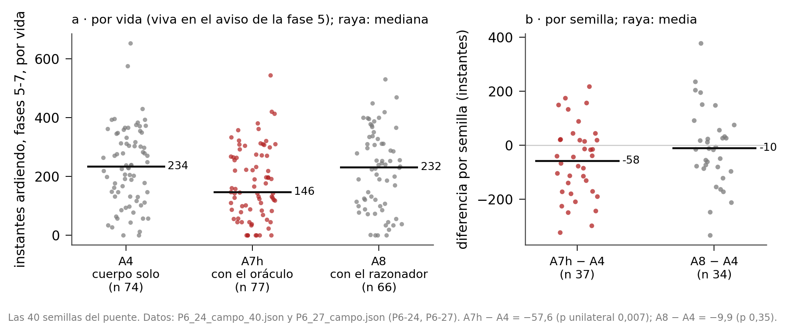
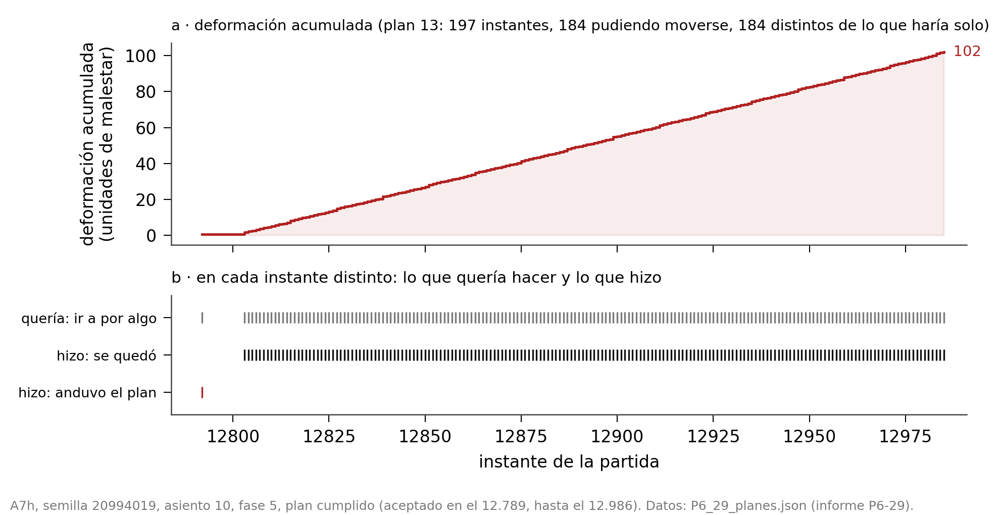

# G-EMV: emoción y razón en un agente. Ayudar sin mandar

Manel Enrico y Ari Sklar\
Manel Enrico: investigador independiente, Barcelona. ORCID: 0009-0008-1732-6310\
Ari Sklar: investigador independiente, Los Ángeles¹. ORCID: 0009-0000-8005-4524\
Preprint, versión 1, 2026\
Sexto trabajo de una línea de investigación que empezó con el motor [1]; sigue directamente al anterior [2]. La serie entera: github.com/Manelenrico/g-emv.\
[1] Enrico, M. (2026). G-EMV: A Geometric Architecture of Homeostatic Orientation for Agents. Zenodo. DOI 10.5281/zenodo.21026795.\
[2] Enrico, M. (2026). G-EMV: Emotion and Reason in an Agent. Curiosity, Trust and Commitment. Zenodo. DOI 10.5281/zenodo.23035785.\
¹ Este trabajo se hizo mientras el autor era contratista en Softmax.

## Resumen

Este trabajo pregunta si una razón puede ayudar a una pareja de criaturas artificiales sin mandarles. Cada criatura es un cuerpo que busca su propio equilibrio entre necesidades que tiran en direcciones opuestas, sin recompensa que perseguir ni entrenamiento. Cada una tiene su propia razón, que le propone planes, y el cuerpo los juzga y decide.

Primero, la pareja: cuando los hermanos empiezan a contarse lo que ven, se separan, porque la voz ocupa el sitio de la cercanía; una sensación que duele cuando el hermano queda lejos devuelve a la pareja su forma. Después, el sitio de la razón: el fuego del final de la partida, donde las criaturas mueren teniendo un camino a salvo porque prefieren quemarse a dejarse ver. Con un consejero de reglas que responde al instante, una imaginación honesta de sí mismo, un plan de ir y quedarse y una manera proporcionada de soltarlo, la pareja pasa menos tiempo ardiendo, resultado replicado con cuarenta semillas. Un modelo de lenguaje ve aceptadas sus propuestas tanto como las del consejero de reglas, pero llega tarde: en el campo no detectamos ni mejora ni empeoramiento, porque el cuerpo tira el consejo caducado, y cuando lo rechaza, casi nunca encontraba otro plan de ir y quedarse que le pareciera mejor. Medimos también el precio de obedecer: el plan retiene mucho al cuerpo, ningún plan se suelta por lo aguantado y, al terminar, el cuerpo vuelve a decidir como antes, porque en este diseño el esfuerzo no se acumula.

La lección es que lo imprevisible está en los otros, y que nuestra manera de preverlos no basta; aprender de lo vivido es el paso siguiente. Todo se midió en un solo mundo, privado y con rivales elegidos.

*Palabras clave: homeostasis, arquitectura afectiva, modelo de lenguaje, pareja, consejo, compromiso, carga alostática, alineamiento.*

## 1. La pregunta

**Tercera parte de una historia.** Esta serie pone junto a un cuerpo que siente una razón que habla y pregunta qué le añade. El cuerpo es una criatura artificial que busca su propio equilibrio: tiene necesidades que tiran en direcciones opuestas y elige, veinticuatro veces por segundo, lo que más le acerca a donde quiere estar. La razón es un modelo de lenguaje que lee la escena y propone. Desde el principio, el reparto es el mismo: la razón propone y el cuerpo decide.

La primera parte encontró que la razón casi no tenía sitio en el mundo de juego que usamos, porque no había tiempo para pensar: la vida duraba dos minutos y siempre había alguna amenaza encendida. La segunda parte le dio tiempo al mundo y construyó una manera mejor de escuchar consejos: planes enteros que el cuerpo juzga imaginando lo que sentirá al recorrerlos. Aun así, en cien partidas, los planes no le dieron ventaja al cuerpo. Y dejó una lección: casi todo lo que puede mejorar el futuro de la criatura pasa por los otros, y a los otros no se les puede prever.

**Por qué ahora la pareja.** Las criaturas de este mundo nacen de dos en dos: dos hermanos que salen juntos y comparten la partida contra todos los demás. Hasta ahora, cada criatura tenía su propio consejero y el hermano era solo alguien a quien cuidar. Pero el hermano es especial entre los otros: es el único que habla, el único cuyo futuro se puede conocer porque lo cuenta. Si lo valioso pasa por los otros, el primer otro con el que se puede contar es él.

**La pregunta.** De ahí sale la pregunta de este trabajo: ¿puede la razón ayudar a una pareja de criaturas sin mandarles? Cada hermano tendrá la suya, su propia razón, que le aconseja solo a él; no hay una cabeza que dirija a los dos. Ayudar quiere decir que la pareja viva mejor con el consejo que sin él. Sin mandarles quiere decir que cada cuerpo siga siendo quien decide: que pueda decir que no y que nadie escriba en su tabla lo que tiene que sentir.

**Cuándo dar la pregunta por contestada.** Para no alargar el trabajo sin fin, ni cerrarlo antes de tiempo, fijamos de antemano tres cosas que había que haber probado antes de darlo por terminado. Que la imaginación del cuerpo, cuando juzga un plan, tenga en cuenta cómo pegan los otros. Que haya dos razonadores, uno por hermano, que se hablen solo a través de los cuerpos. Y que el razonador escuche los rechazos del cuerpo y lo vuelva a intentar. Las tres están hechas, y las tres se cuentan en las secciones siguientes.

**Lo que sigue.** La sección 2 presenta el cuerpo y el mundo. La sección 3 cuenta lo que le pasa a la pareja cuando los hermanos empiezan a compartir lo que ven. La 4 busca dónde puede ayudar la razón, y lo encuentra en el fuego del final de la partida. La 5 construye, con un consejero de reglas que responde al instante, el puente por el que un consejo llega al cuerpo sin que el cuerpo deje de decidir. La 6 pone en su sitio a un modelo de lenguaje de verdad. La 7 mide cuánto le cuesta al cuerpo obedecer. La 8 dice qué queda de la pregunta, y la 9, cómo se midió todo y hasta dónde llega.

**Con quién conversa este trabajo.** La idea de que un modelo de lenguaje proponga y algo que no habla decida no es nuestra: se ha usado en robótica, donde un modelo de lenguaje sugiere acciones y otra pieza juzga cuáles son posibles (Ahn y otros, 2022). También hay trabajos que protegen a un agente que aprende con un escudo, un filtro que le impide hacer lo peligroso (Alshiekh y otros, 2018), y una larga tradición que piensa los planes y el compromiso con ellos como parte de la mente de un agente (Bratman, 1987; Cohen y Levesque, 1990; Rao y Georgeff, 1995). Del lado del cuerpo, nos apoyamos en la idea de que regular el cuerpo es anticiparse a lo que va a necesitar, no solo reaccionar (Barrett, 2017), en el coste de mantenerlo lejos de su equilibrio (McEwen, 1998) y en la propuesta de construir máquinas que sientan a partir de la homeostasis (Man y Damasio, 2019). Lo que este trabajo añade es la combinación: una razón que propone a un cuerpo que siente, en una pareja que se cuida en un mundo compartido con otros, medido instante a instante.

## 2. El cuerpo y el mundo

Aquí se cuenta lo justo para seguir la historia: cómo es el cuerpo, cómo es el mundo y qué piezas se añaden en este trabajo.

**Un cuerpo que busca su equilibrio.** La criatura tiene necesidades en tres ejes: cómo está su cuerpo, cómo están sus recursos y cómo están sus vínculos. En cada eje hay fuerzas que tiran en direcciones opuestas, y sobre los tres hay un punto donde querría estar. A lo lejos que está de ese punto lo llamamos malestar. Es una palabra de comodidad, no un diagnóstico: el malestar es una distancia, y lo que cuenta es hacia dónde va. Cuando baja, la criatura se acerca a su equilibrio; cuando sube, se aleja. Entre el mundo y esas necesidades hay una tabla, una lista de situaciones, cada una con la fuerza con que tira y en qué eje. Unas la alejan de su equilibrio: que te disparen, que el anillo se acerque, que el hermano esté herido. Otras la acercan: tener comida a mano, un botiquín a la vista, el hermano a tu lado. Cada cosa es una fila. Cuando decimos que algo le duele o le atrae, queremos decir eso y nada más: que una fila de su tabla tira. No afirmamos nada sobre lo que la criatura experimenta.

**Cómo decide.** Veinticuatro veces por segundo, la criatura imagina un puñado de cosas que podría hacer: ir a algún sitio, coger algo, acercarse al hermano, curarse, quedarse quieta. Para cada una imagina dónde estaría y cómo se sentiría, la puntúa con su tabla y elige la que más le acerca a su equilibrio. Cada una de esas veinticuatro veces es un instante. Al instante siguiente vuelve a empezar. No hay recompensa que perseguir ni entrenamiento, y de una partida a otra no recuerda nada. El motor que hace estas cuentas es el mismo de los trabajos anteriores y no se ha tocado.

**El hermano.** Las criaturas juegan por parejas. Los dos hermanos son la misma criatura: el mismo cuerpo, la misma tabla, la misma manera de decidir. Lo que los distingue es dónde están, cuánta vida les queda y lo que ve cada uno. Cada uno siente al otro: le duele cuando a él le pegan, cuando está herido o cuando le falta. Y cada uno le manda al otro, cada dos segundos, un mensaje corto que llamamos parte: dónde está, cuánta vida le queda, qué lleva y quién le pega.

**El mundo.** El juego es un mundo de casillas, visto desde arriba, donde dieciséis criaturas, ocho parejas, compiten por sobrevivir. Hay comida, botiquines y armas en el suelo, y un anillo de fuego que, por fases, va cerrando la zona segura hacia el centro. Usamos la misma configuración lenta del trabajo anterior: partidas el doble de largas que las normales y un anillo que llega tarde y se cierra despacio. Los rivales, los mismos en todas las partidas, son programas de otros participantes, elegidos mirando partidas enteras entre los que menos atacan. En este mundo, el enemigo principal de nuestra pareja ya no son los rivales, sino el anillo: es lo que más la mata.

**El reloj del mundo.** El juego no espera a nadie. Avanza a veinticuatro instantes por segundo y aplica, en cada instante, la primera acción que ha recibido de cada criatura desde el anterior; una segunda acción de la misma criatura en el mismo instante se descarta. Una acción que llega tarde se aplica un instante después de lo que el cuerpo quería, o no se aplica si la siguiente ya le ha ocupado el sitio: el mundo ya ha seguido. Esto tendrá mucha importancia para una razón que tarda segundos en contestar, y también para nuestra propia máquina, como contamos en la sección 5.

**Lo que se añade en este trabajo.** Se partió del cuerpo del trabajo anterior. Durante las primeras pruebas de la sección 3 se corrigieron dos defectos heredados: un bucle en que un hermano soltaba y recogía sin fin un regalo para el otro, y el empeño en coger cosas con la mochila llena, que lo dejaba clavado en el sitio. Un tercero, creer que un rival sin arma no pega, se arregla en la sección 3, porque solo se notó cuando la pareja empezó a ir junta. Sobre ese cuerpo se añaden, en este orden, unas piezas que se cuentan cada una en su sección: los ojos compartidos y una sensación nueva de distancia al hermano (sección 3); un consejero de reglas, una puerta honesta para juzgar sus planes, un plan de ir y quedarse y una manera proporcionada de soltarlo (sección 5); y un razonador de lenguaje en el sitio del consejero (sección 6). Cuando el cuerpo estuvo terminado, al final de la sección 3, lo congelamos: desde entonces, todo lo que cambia está fuera de él. Ese cuerpo congelado, solo, sin consejero, es la referencia contra la que se compara todo lo demás.

## 3. La pareja

Antes de buscarle un sitio a la razón, miramos a la pareja sola: qué hace cada hermano con lo que le cuenta el otro, y qué pasa cuando le cuenta más.

**Lo que ya había.** En este mundo las criaturas nacen de dos en dos: dos hermanos que salen juntos, se ayudan y comparten la partida contra todos los demás. Desde el trabajo anterior, cada uno le manda al otro un mensaje corto cada dos segundos, un parte: dónde estoy, cuánta vida me queda, qué llevo encima, quién me está pegando. Antes de cambiar nada, miramos veinte vidas de parejas para ver qué hacía cada uno con lo que le contaba el otro.

Iban pegados. La mitad del tiempo, a dos casillas o menos, y nueve de cada diez instantes a cuatro o menos. Aun así, cada uno veía cosas que el otro no veía: una cuarta parte de lo que tenía a la vista cada hermano era solo suyo, y en cerca de la mitad de los instantes uno de los dos tenía delante un rival que el otro no veía. El parte no contaba nada de eso. Y lo que sí contaba, quien lo recibía lo leía, pero casi solo le servía para cosas que ya tenía delante: si el hermano le hablaba de un botiquín, el cuerpo solo podía ir a por él si también lo estaba viendo. El nombre llegaba, pero no lo veía. Había un caso que lo resume todo: un hermano pasó unos cuatro minutos sin una ración, con su hermano mirando unas raciones a cinco casillas. El otro las veía; él no; y el parte no decía nada de ellas. El canal por el que viajaban los partes iba casi vacío: cabía siete veces y media lo que se mandaba.

**Los ojos compartidos.** Así que ampliamos el parte. Además de lo de siempre, cada hermano cuenta ahora los rivales que ve y las cosas útiles que tiene cerca, y lo manda cada segundo en lugar de cada dos. Y quien lo recibe se lo cree: los rivales que le cuentan cuentan como si los viera con sus propios ojos, y las cosas útiles también, mientras el recuerdo está fresco; si nadie lo repite, lo olvida poco a poco, como se olvida lo que alguien nos dijo hace un rato. A esto lo llamamos los ojos compartidos. No hicimos ninguna fila nueva en la tabla del cuerpo: el cuerpo es el mismo, solo que ahora ve también por los ojos de su hermano.

**Un peligro que no se cobraba.** Habíamos construido los ojos compartidos pensando, sobre todo, en proteger a cada hermano de los golpes que no ve venir: en las primeras vidas que miramos había cientos de momentos en que un rival armado apuntaba a un hermano que no lo veía y el otro sí. Pero cuando contamos los golpes de verdad, de casi setecientos, dos de cada tres eran del anillo, casi todos los demás de rivales que el golpeado tenía a la vista, y ni uno solo de un rival que no viera. Aquellos momentos eran ocasiones de golpe, no golpes. Los ojos compartidos tenían que demostrar su valor por otro lado.

**Con ojos, viven menos.** La serie dijo algo que no esperábamos. Llamamos brazo a cada versión de la pareja que comparamos, y comparamos siempre los brazos en los mismos mundos, con los mismos rivales en los mismos sitios. La pareja con ojos compartidos vivió menos que la pareja con el parte de siempre: casi un minuto menos por vida, de media. No es una diferencia firme, podría ser en parte suerte, pero apuntaba en la dirección contraria a la que buscábamos. Algo sí mejoró de verdad: la sorpresa. Cada instante, el cuerpo imagina lo que va a sentir en el siguiente, y a menudo se equivoca porque aparece de repente un rival que no esperaba. Medimos esa sorpresa en la fila que duele cuando te ven, la que más se escapaba a su imaginación: con los ojos del hermano, bajó a menos de la mitad. La pareja sabía más del mundo. Y aun así vivía menos.

**Por qué: la voz ocupa el sitio de la cercanía.** Seguimos el hilo vida a vida, y salió una cadena. Primero, la pareja se separaba: antes pasaba ocho de cada diez instantes a tres casillas o menos; con los ojos compartidos, seis. Las escapadas largas, en las que un hermano pasa más de ocho segundos a más de ocho casillas del otro, se multiplicaron por seis. Segundo, no volvía. Para volver junto al hermano hay que acercarse a él, y el hermano estaba contando que tenía rivales al lado, así que el camino de vuelta se sentía como un camino hacia el peligro, y el cuerpo prefería no darlo. Tercero, lejos del hermano, a veces se quedaba atascado por un defecto heredado que contamos en la sección 2. Y cuarto, moría lejos: los que morían a manos de un rival morían a unas diez casillas de su hermano, cuando antes morían a una.

Hay una razón de fondo que lo explica. El cuerpo tiene una sensación de soledad que se enciende cuando el hermano falta. Pero con el parte llegando cada segundo, el hermano nunca falta: su voz cuenta como presencia. Es lo que pasa con un teléfono en el bolsillo: sabes dónde está el otro, oyes que está bien, y ya no sientes la necesidad de estar cerca. La información sustituyó a la cercanía, y la pareja se aflojó.

**El rescate que existe.** Antes de tocar nada, medimos cuándo puede un hermano salvar al otro. Cuando un rival armado mata a una criatura, la pelea dura unos seis o siete segundos, desde el primer golpe hasta el último, y en ese tiempo un hermano puede recorrer entre trece y dieciséis casillas. Casi siempre, el otro habría llegado a tiempo si hubiera ido. Pero no iba: en las peleas con un rival armado, en las dos parejas con ojos compartidos, el otro llegó una vez de cuarenta y seis, y dos de cuarenta y cuatro. En la pareja de siempre parecía llegar más a menudo, pero no porque acudiera: es que ya estaba allí, a tres casillas, y simplemente no se había ido. El rescate que existe es estar al lado, no acudir.

**Lo que ha hecho la naturaleza.** Aquí entra una decisión de diseño que no se deduce de los números. Los animales que viven en grupo se dispersan para buscar comida, pero sin perderse de vista, o con escapadas cortas y vuelta rápida al grupo, para poder ayudar o ser ayudados. Cuando se alejan, gritan, y el grito se oye lejos: ese es su parte. Una escapada larga, solo en mucha calma y sabiendo que, solo, uno está más expuesto. Hicimos lo mismo. Le dimos al cuerpo una sensación que no duele mientras el hermano está a distancia de rescate, y que empieza a doler, y crece, cuando se aleja más. La distancia de rescate no la inventamos: es la que permite llegar con media pelea todavía por delante, unas siete casillas de camino. Y la sensación crece más despacio cuanta más calma hay: en calma, el cuerpo puede permitirse alejarse un poco más; con miedo, no. La soledad de verdad, la que no se va, se quedó para cuando el hermano muere. Mientras vive, lo que duele es la distancia, graduada: cuanto más lejos, más.

Dentro de la distancia de rescate la sensación no tira, y eso era importante. En un trabajo anterior ya habíamos probado algo parecido, y lo apagamos porque, con fuerza suficiente, hacía que el cuerpo dejara la comida a dos casillas para irse hacia su hermano. Esta no: mientras están cerca, cada uno hace su vida.

**La pareja recupera su forma.** Con esa sensación, la pareja volvió a ir junta tanto como la pareja de siempre: ocho de cada diez instantes a tres casillas o menos. Ni un solo instante a más de quince. De treinta escapadas largas, quedó una. Vivió más que la pareja con ojos sin la sensación, casi un minuto y diez segundos más por vida, en catorce de las veinte semillas, y un poco más que la pareja de siempre, aunque esta última diferencia es pequeña y no se distingue del azar. Fue la primera versión que vivió tanto como la pareja sin ojos compartidos, o algo más, y ahora con sus ojos. Y cuando uno de los dos moría con el otro vivo, en todas las muertes el otro estaba a distancia de rescate. La figura 1 lo enseña, brazo a brazo.

**Las manos vacías.** Al estar juntos más tiempo apareció otro problema. El cuerpo no tenía miedo de un rival que va con las manos vacías, porque su tabla solo contaba como amenaza a quien lleva un arma. Pero en este mundo el puñetazo existe: hace poco daño, más o menos un sexto de lo que hace una espada, pero lo hace. Y la pareja, ahora unida, se quedaba al lado de esos rivales, recibiendo golpes, porque nada le decía que se apartara. Murieron seis criaturas así, contra dos en la pareja de siempre. Son pocas muertes, y con tan pocas el azar pesa mucho, pero los golpes se contaban por cientos. Sin tocar la tabla, le enseñamos al cuerpo a ver unas manos vacías como un arma pequeña, que pega poco y solo de cerca; y como un arma de verdad si ese rival le está pegando a él o a su hermano. Las muertes a puñetazos bajaron de seis a dos, y los golpes, algo.

Tuvo un precio, y lo declaramos. La pareja cogió menos comida: de casi cuatro cosas de comer por vida pasó a menos de tres, algo menos que la pareja de siempre. Casi todo el cambio es un paso de lado: en lugar de ir a por un botín que tenía al lado un rival desarmado, se apartaba. Es un cuerpo un poco más prudente, que prefiere pasar algo de hambre a recibir un golpe evitable. Lo aceptamos, y con eso dimos el cuerpo del seis por terminado y lo congelamos: desde aquí, todo lo que cambia está fuera del cuerpo.

**Lo que deja la pareja.** Con este cuerpo, casi todas las parejas llegan juntas al momento en que el anillo empieza a cerrarse: diecinueve de veinte. Los dos hermanos, solos, ya se cuidan bien. Pero después, más de la mitad de todas las criaturas acaban muriendo quemadas por el anillo. Ahí, al final de la partida, está el sitio que buscábamos para la razón. Es lo que cuenta la sección siguiente.

## 4. El anillo, donde la razón tiene sitio

Cuando la pareja ya se cuidaba bien, lo que la mataba era el fuego del final de la partida. Ahí buscamos el sitio de la razón.

**El anillo.** En este mundo, la zona segura se va encogiendo por fases, siete en total, siempre hacia el mismo centro. Fuera de ella, el fuego quema un poco cada segundo. El calendario entero se conoce desde el primer instante: cuándo empieza cada fase, hasta dónde se cierra y cuánto quema. El cuerpo lo sabe, y lo imagina bien. De todo lo que el cuerpo imagina que va a sentir, lo que menos le sorprende es el fuego. No es un peligro escondido. Es un peligro anunciado.

La fase que mata es la quinta, cuando el círculo pasa de un radio de ocho casillas a uno de cinco. De las veintidós criaturas que murieron quemadas en nuestras cuarenta vidas de referencia, dieciséis murieron en esa fase. Casi ninguna murió por el final inevitable, cuando ya no queda sitio para nadie: la partida suele terminar antes, cuando queda un solo equipo en pie.

**Un camino a salvo, siempre.** Miramos una por una esas veintidós muertes, y en las veintidós había un camino a la zona segura. En veintiuna se habría llegado a tiempo saliendo cuando el juego avisa, y en diecinueve incluso saliendo con el primer golpe del fuego. La mitad de ellas, a dos pasos o menos: un segundo de camino, con unos cuarenta segundos de margen desde que el juego avisa de que el círculo se va a cerrar. No murieron atrapadas. Murieron a un paso.

En doce de ellas, lo que las retuvo fue el miedo: el centro seguro estaba lleno de rivales, y entrar era dejarse ver. En otras ocho, habrían llegado si hubieran salido un poco antes. Dentro del cuerpo, la cuenta es clara. Hay una fila que empuja a ir hacia el sitio seguro antes de que el fuego llegue, y otra que duele cuando te ven los rivales. Las dos saben lo que tienen que saber. Pero cuando chocan, gana la segunda: su máximo, lo más que puede llegar a doler, es casi el doble que el de la primera. No es un error de percepción. Es una cuestión de valores: para este cuerpo, ser visto duele más que quemarse un poco. Como una persona que no sale de un edificio lleno de humo porque en la puerta hay desconocidos que le dan miedo.

**Por qué ahí puede ayudar la razón.** Un plan no le da al cuerpo nada que no sepa: el cuerpo ya conoce el anillo y ya ve a los rivales. Lo que le da es horizonte. El cuerpo decide instante a instante, y en cada instante gana el miedo. Un plan mira más lejos: dentro de treinta segundos aquí no se podrá estar, y el único sitio donde se podrá estar es ese, con rivales o sin ellos. En diecinueve de aquellas veintidós muertes había una casilla segura al alcance: con un poco más de horizonte, quizá se habrían evitado.

Podríamos haber cambiado los valores del cuerpo, haciendo que el fuego pesara más que el miedo. No lo hicimos por dos razones. El cuerpo ya estaba terminado y congelado. Y cambiarlo habría borrado justo la pregunta de este trabajo: si una razón puede ayudar a un cuerpo sin cambiarle lo que siente.

**Cuatro maneras de sobrevivir, medidas antes de construir.** Para el final de la partida pensamos cuatro estrategias, tres de ellas de diseño propio y la cuarta surgida al mirar los datos. Antes de construir ninguna, buscamos en las vidas ya jugadas los momentos en que la criatura, por su cuenta, había hecho algo parecido, y medimos qué le pasaba.

*Salir y volver.* Si dentro del círculo hay demasiada gente peleando, salir un rato al fuego, aguantar mientras quede vida y volver a entrar cuando haya sitio. Las cuentas salen: en la fase que mata, con toda la vida, se aguantan unos doce segundos fuera. Y en casi la mitad de las muertes había margen para hacerlo. Pero curarse fuera casi no sirve, y no llegamos a comprobar si la criatura, por su cuenta, sale y vuelve a entrar alguna vez. Es una estrategia posible sobre el papel, y nada más que eso.

*Entrar juntos.* Entrar los dos a la vez, uno detrás del otro, cubriéndose. Las criaturas que entraban junto a su hermano sobrevivían más o menos igual que las que entraban solas. No encontramos una ventaja clara en entrar juntos.

*Defenderse juntos.* Si alguien ataca a uno, atacar los dos a la vez. Cuando los dos hermanos pegaban, el agresor moría cuatro de cada diez veces y el golpeado casi nunca. Cuando no pegaba ninguno, el agresor casi nunca moría y el golpeado, casi dos de cada diez veces. Parece mucho, pero hay que leerlo con cuidado: no es un experimento, son peleas que las criaturas eligieron, y las que pegan juntas pueden ser las que ya iban mejor. Lo curioso es que, en tres de cada cuatro casos en que el hermano no pegaba, llevaba un arma: no le faltaban medios, le frenaban otras cosas que sentía. Por eso lo llamamos un sitio mediano para la razón: hay algo que ganar, porque cuando los dos pegan la pelea cambia, pero menos que en quedarse y con menos seguridad de que la ganancia sea de verdad, porque una parte puede venir de qué peleas se eligen y no de pegar juntos. Además, en el momento de medirlo no podíamos convertirlo en plan, porque el cuerpo, cuando imagina el futuro, todavía no imaginaba los golpes de los otros. Eso llegó después.

*Quedarse.* La cuarta salió de los datos. Las criaturas que no entraban en el círculo en la fase que mata morían todas, sin excepción. Las que entraban sobrevivían entre seis y ocho de cada diez veces. Y entre las que entraban, lo que separaba a las que vivían de las que morían no era entrar juntas ni tener rivales cerca: era cuánto tiempo pasaban ardiendo. Las que no ardían nada sobrevivían ocho de cada diez veces. Las que, aun entrando, pasaban más de cuatro segundos ardiendo, seis de cada diez.

Y aquí apareció lo más revelador. Llegar no es quedarse. En las primeras pruebas con un consejero que solo proponía ir al centro (las contamos en la sección 5), de sesenta y cinco veces en que el plan llevó a la criatura al sitio seguro, solo se quedó en dos. En las otras sesenta y tres volvió a salir al cabo de medio segundo, por su propio pie. No salía por miedo a los rivales: salía a por algo que necesitaba, un objeto o comida, o porque su hermano acababa de morir. La necesidad y el duelo la sacaban del sitio donde podía vivir.

**El sitio de la razón.** El veredicto fue claro. Quedarse, un sitio grande. Defenderse juntos, mediano. Salir y volver, solo sobre el papel. Entrar juntos, ninguno que pudiéramos ver. Así que lo que la razón podía ofrecer no era un camino hacia el centro, que el cuerpo ya conoce, sino un plan que dijera: ve, y quédate aunque te llame otra cosa. La figura 2 muestra la fase que mata por dentro: entrar, y pasar poco tiempo ardiendo, va de la mano de sobrevivir. Son vidas observadas, no un experimento: las criaturas eligen dónde ponerse, así que es una asociación, no una prueba de causa.

Una nota de método que vale para el resto del trabajo. Con veinte semillas por brazo, las diferencias en cuántas criaturas sobreviven o en cuánto viven se pierden en el azar: habría que ganar o perder unas diez vidas de cuarenta para distinguirlo. Por eso, desde aquí, medimos sobre todo por instantes (cuántos pasa la criatura dentro del círculo, cuántos ardiendo) y por planes (cuántos se aceptan, cuántos se sostienen). Estas medidas dejan ver cambios más pequeños, pero no multiplican las pruebas: los instantes y los planes de una misma partida no son independientes entre sí. Por eso las comparaciones principales se hacen semilla a semilla: una cifra por semilla y brazo, y se cuenta en cuántas semillas mejora y en cuántas empeora. Para el resultado principal del trabajo sí ampliamos la muestra: lo jugamos con el doble de semillas (sección 5). Lo contamos con más detalle en la sección 9.

## 5. El puente: un consejero que el cuerpo pueda creer

**Por qué lo llamamos puente.** Entre una razón que propone y un cuerpo que siente hay un río: la razón habla en planes, el cuerpo decide instante a instante con lo que siente. Llamamos puente a todo lo que deja pasar una propuesta de un lado al otro sin que el cuerpo deje de ser quien decide: la manera de juzgar el plan, la de comprometerse con él y la de soltarlo. Esta sección cuenta cómo construimos ese puente, pieza a pieza, y qué pasó cada vez que una pieza fallaba.

**Un consejero que conoce el fuego.** Antes de poner una razón de verdad, un modelo de lenguaje, quisimos probar el puente con una ayuda sencilla y sin demora. Construimos un consejero de reglas, sin lenguaje y sin pensar: conoce el calendario del anillo, ve a los rivales y propone a cada hermano un plan sencillo, una casilla segura a la que ir. Lo llamamos el oráculo, porque sabe lo que va a pasar con el fuego. No es el mejor consejero imaginable, pero sus propuestas son buenas y llegan al instante: si el puente no dejaba pasar ni esto, no tenía sentido probar con uno que habla y tarda.

El cuerpo no obedece al consejero. Cada plan que le llega pasa por una puerta: el cuerpo imagina lo que sentiría si lo siguiera y lo compara con lo que sentiría haciendo lo suyo. Si el plan sale mejor, lo acepta; si no, sigue con lo suyo. Y si lo acepta, se compromete: lo sigue paso a paso aunque en algún instante otra cosa le tire, hasta llegar o hasta que algo serio le obligue a soltarlo. La puerta y el compromiso vienen del trabajo anterior. Son la manera de que el cuerpo escuche sin dejar de decidir.

**El cuerpo se creía más constante de lo que es.** La primera medida fue un jarro de agua fría. El oráculo proponía y proponía, y el cuerpo decía casi siempre que no: de cada cien planes, aceptaba menos de uno. Miramos las criaturas que habían muerto quemadas teniendo un sitio seguro a su alcance, que eran diecinueve. El oráculo les había propuesto planes para ponerse a salvo, pero solo tres habían aceptado uno a tiempo. Buscamos el motivo esperando encontrar el miedo, y no era el miedo. Era la comparación.

Para decidir si un plan es mejor, la puerta lo compara con lo mejor que el cuerpo haría por su cuenta, y lo imaginaba como si el cuerpo fuera a recorrer ese camino propio de principio a fin. En esa imaginación, el cuerpo ya salía del fuego solo, así que el plan no le aportaba nada. Pero en la realidad, paso a paso, el miedo de cada instante le hacía volver atrás. En ocho de cada diez rechazos en que el cuerpo se creía a salvo, el cuerpo real estaba ardiendo o ya había muerto. Se imaginaba con más vida de la que tuvo. Es una debilidad muy humana: rechazar la ayuda porque uno se ve haciendo solo lo que en realidad no va a hacer. Como quien dice "mañana empiezo" y ya se siente un poco en forma.

**La puerta honesta.** La pregunta de diseño era con qué debe compararse el plan: con lo que el cuerpo haría en su mejor versión, o con lo que de verdad hace. La respuesta fue la segunda. Cambiamos la imaginación de la puerta: ahora el cuerpo se imagina a sí mismo decidiendo instante a instante, con su propia manera de decidir, miedo incluido. Una imaginación honesta consigo misma. Con ella, en diecisiete de aquellas diecinueve muertes había un plan que el cuerpo habría aceptado a tiempo. Y no tocamos ni una fila de su tabla: lo que separaba la ayuda de la no ayuda no estaba en lo que el cuerpo siente, sino en cómo se imagina.

**Aceptar no es sostener.** En el campo, la puerta honesta aceptó unas cuarenta veces más planes que la antigua, y el compromiso hizo que el cuerpo los anduviera. Pero las criaturas no vivieron más. Ya lo contamos en la sección 4: el plan las llevaba al sitio seguro, y al cabo de medio segundo salían otra vez, a por algo que necesitaban. Llegar no es quedarse.

Así que el plan cambió. Ya no dice solo "ve allí", sino "ve allí y quédate": llegar, esperar, seguir esperando y aguantar hasta que acabe la fase. Con la puerta honesta, el cuerpo prefería quedarse en tres de cada cuatro de aquellos momentos en que antes salía. En el campo, el plan sujetaba: más de mil pasos de salida se quedaron sin dar. Pero solo dos de los setenta y cuatro planes aceptados llegaron hasta el final de la fase; los demás se soltaron por el camino.

**El cuerpo teme a los otros más de lo que pegan.** Pensamos primero que los planes se rompían porque la imaginación del cuerpo no contaba los golpes de los rivales que hay dentro del círculo. Medimos cómo pegan de verdad, en cientos de vidas, y se lo pusimos en la imaginación. Casi no cambió nada, y por una buena razón: los rivales pegan poco. Un rival a tiro casi nunca dispara; los arcos y las cerbatanas, casi nunca hacen daño; solo una espada pegada a ti es un peligro serio. En las fases finales, tres de cada cuatro puntos de daño los pone el anillo, no los rivales.

Lo que rompía los planes eran dos reglas nuestras. La primera, la que suelta el plan cuando hay un peligro para la vida: saltaba en cuanto aparecía un arco o una cerbatana a tiro, armas que casi nunca hacen daño. La segunda, la que suelta el plan cuando la vida real queda por debajo de la imaginada: le echaba la culpa al plan del fuego que el cuerpo se comía cuando se desviaba de él. El cuerpo, en resumen, temía a los otros más de lo que pegaban, y nuestras reglas de abandono le daban la razón.

**Un veto proporcionado.** La manera de soltar un plan se rehízo con un diseño que viene de cómo reaccionamos las personas. Ver un arma ya no rompe el plan: pone al cuerpo en alerta. Al primer golpe, el plan se suspende y decide el cuerpo, con su tabla: defenderse o apartarse, sin salir del círculo. Y solo sale si dentro pierde más vida que la que perdería fuera, en el fuego. Además, el umbral depende de la vida que le queda. Con reserva, puede esperar al primer golpe; débil, no puede esperar, y se aparta antes. Quien está más inseguro es más reactivo, como en la vida real. Y la otra regla, la que compara la vida real con la imaginada, se volvió justa. Antes, si el cuerpo acababa con menos vida de la que el plan le había hecho imaginar, el plan se daba por malo y se soltaba, aunque la vida se hubiera perdido por culpa del propio cuerpo. Por ejemplo: el plan dice quédate; el cuerpo sale un momento a por una ración, se quema fuera, y la regla concluye que el plan está fallando. Ahora la cuenta separa las dos cosas: el fuego que el cuerpo recibe mientras sigue el plan cuenta contra el plan; el que recibe por salirse de él, no. Es la diferencia entre culpar al médico de una receta que no te has tomado y culparle de una que sí.

**Recuadro. Los pasos que no llegaban.** Al probar el veto nuevo apareció algo que no era del cuerpo ni del consejero, sino de nuestra máquina. El juego avanza a su ritmo, veinticuatro instantes por segundo, como un tren que sale a su hora: si la decisión no está en el andén a tiempo, el tren se va sin ella. En los instantes en que el consejero trabajaba, nuestro programa tardaba demasiado en juzgar el plan, porque copiaba entera la memoria del cuerpo antes de imaginar. Y mientras tanto, el paso que el cuerpo ya había decidido no llegaba al juego. En el tramo final de la partida, justo donde trabaja el consejero, se perdían cuatro de cada diez pasos. Un cuerpo que pierde casi la mitad de sus pasos en el fuego no puede demostrar nada. Las conclusiones de campo que habíamos sacado hasta ahí quedaban sin valor como prueba, aunque no las de banco, que no pasan por el reloj. Las cifras de campo de esta sección anteriores al recuadro (los planes aceptados, las salidas, los dos de setenta y cuatro) son de esas pruebas: sirvieron para orientar el diseño, no para demostrar nada. Lo arreglamos haciendo el juicio aparte, sin frenar al cuerpo, y los pasos perdidos bajaron a menos de uno de cada doscientos. Repetimos el campo desde cero. Y comprobamos el trabajo anterior, que también perdía pasos en los brazos con la puerta: sus conclusiones se sostenían, y lo corregimos antes de publicarlo.

**El resultado.** Con todas las piezas juntas, la puerta honesta, el plan de ir y quedarse, el compromiso, el veto proporcionado y la cuenta justa, jugamos una serie de veinte semillas contra el cuerpo solo. Antes de jugar dejamos escrito lo que esperábamos y con qué medida lo íbamos a juzgar: lo llamamos sellar la predicción, para no poder elegir después la medida que mejor quedara. La medida principal: para cada criatura viva cuando el juego avisa de la fase que mata, cuántos instantes pasa ardiendo desde ahí hasta el final. El resultado apuntaba bien, pero justo. Así que, antes de apoyarnos en él, lo repetimos con veinte semillas nuevas y la misma medida sellada.

La réplica dijo lo mismo: en la primera tanda, unos cincuenta y tres instantes menos ardiendo por vida; en la réplica, unos sesenta y dos. Con las cuarenta semillas juntas, la pareja con el consejero pasa unos cincuenta y ocho instantes menos ardiendo por vida en el tramo final, dos segundos y medio menos de fuego, en el momento de la partida en que se muere. Mejora en veinticuatro semillas y empeora en trece. Si el consejero no sirviera de nada, una diferencia tan favorable como esta saldría menos de una vez de cada cien. Además, pasa más tiempo dentro del círculo en la fase que mata, y los planes que acepta se sostienen mucho más: en la réplica, más de uno de cada cuatro llegó hasta el final de la fase, y juntando las dos tandas, cerca de uno de cada cinco, cuando antes no llegaba casi ninguno. Y no es porque las criaturas con consejero mueran antes y tengan menos tiempo para arder: al contrario. Viven más instantes en las fases finales, más de veinte segundos más de media, y aun así arden en uno de cada doce de sus instantes, frente a uno de cada siete del cuerpo solo. Sobreviven hasta el final treinta de setenta y siete, frente a dieciséis de setenta y cuatro; es una diferencia que apunta en la misma dirección, aunque con estas semillas no la damos por establecida. La figura 3 enseña un plan aceptado, andado y sostenido, de principio a fin.

**Lo que dice el puente.** El puente funciona: una propuesta puede cruzar de la razón al cuerpo y salvarle tiempo en el fuego sin que el cuerpo deje de decidir. En las pruebas ya corregidas, la ayuda apareció con esta combinación de piezas, y cada una responde a un fallo que vimos sin ella. Que el cuerpo pueda juzgar lo que le proponen con una imaginación honesta de sí mismo. Que el plan cubra lo que el cuerpo no sabe hacer solo, quedarse, y no solo lo que ya sabe, ir. Y que la manera de soltarlo sea proporcionada al peligro de verdad, no al miedo. El consejero de este capítulo es un consejero de reglas que responde al instante. La sección siguiente pone en su sitio a uno de verdad, que habla y tarda en contestar.

## 6. El razonador de lenguaje

En el sitio del oráculo ponemos ahora una razón de verdad, que lee la escena en palabras y contesta con un plan, pero que tarda en contestar.

**Una razón que habla.** El razonador es un modelo de lenguaje pequeño y rápido, de los que hoy se usan para conversar. Cada vez que el cuerpo de un hermano entra en un momento difícil del anillo, se le cuenta la escena en palabras llanas: dónde está, cuánta vida le queda, dónde se cerrará el círculo, qué rivales hay y dónde está su hermano. Y él contesta con un plan en el mismo idioma que usaba el oráculo, un idioma de formas sencillas: ir a tal sitio, quedarse, esperar. Ese plan pasa por la misma puerta honesta y el mismo compromiso que en la sección anterior. Cada hermano tiene su propio razonador: el mismo modelo, pero consultado por separado, como dos personas que han ido a la misma escuela pero no se conocen. Ninguno ve lo que ve el otro ni recuerda lo que el otro le ha dicho a su hermano; cada uno sabe lo que sabe su cuerpo, incluido lo que el hermano le ha contado en el parte. Y los dos razonadores solo se hablan a través de los cuerpos: el plan que un hermano acepta viaja en su parte, como todo lo demás. Elegimos un razonador por hermano para estudiar consejos separados que solo se encuentran a través de los cuerpos. Un consejero común para los dos, que también pasara por la puerta de cada cuerpo, es otra posibilidad que no probamos.

**Primero en el banco.** Antes de jugar, lo probamos en el banco: doscientas escenas reales del anillo, guardadas de partidas anteriores, en las que el razonador propone y la puerta juzga, sin reloj y sin juego. Probamos dos modelos, uno pequeño y otro mayor. Los dos propusieron casi siempre lo mismo que el oráculo: ir al sitio seguro y quedarse. Y la puerta aceptó una proporción parecida de sus planes y de los del oráculo, cerca de la mitad. En casi nueve de cada diez escenas, el veredicto fue el mismo viniera el plan de las reglas o del lenguaje.

Esto aclara algo que en el trabajo anterior parecía otra cosa. Allí daba la impresión de que el cuerpo rechazaba al razonador de lenguaje. No era el razonador: era la puerta, que todavía no se imaginaba con honestidad. Con la puerta honesta, al cuerpo le da igual quién le aconseje. Juzga lo que le proponen.

**El reloj.** El modelo pequeño tardaba unos cuatro segundos en contestar; el modelo mayor, más de ocho. En el juego, que avanza veinticuatro instantes por segundo, eso son entre noventa y doscientos instantes. Y el final de la partida cambia mucho en ese tiempo: el fuego avanza, los rivales se mueven, el hermano se mueve. De los planes que la puerta habría aceptado en el momento de pedirlos, cuando llegaba la respuesta del modelo pequeño seguía aceptando la mitad; con el mayor, cuatro de cada diez. Para el campo elegimos el pequeño: acepta igual, tarda la mitad y se equivoca menos al escribir el plan.

**El bucle.** Una de las preguntas de este trabajo era si la razón mejora su siguiente propuesta cuando el cuerpo le dice que no. Así que, cuando la puerta rechazaba un plan, le contábamos al razonador por qué, en palabras, y le pedíamos otro. El segundo intento pasaba pocas veces y el tercero casi nunca. El razonador reformulaba: cambiaba de casilla, pero no encontraba nada que la puerta viera mejor.

¿Era culpa del razonador, o es que no había nada mejor que encontrar? Para saberlo, en cada escena rechazada probamos uno por uno, sin lenguaje, todos los planes posibles de ir a una casilla y quedarse. En ocho de cada diez, la puerta tampoco aceptaba ninguno: según la imaginación del cuerpo, ningún plan de ese tipo mejoraba lo que haría por su cuenta. Así que, en esa familia de planes, el bucle no encontraba nada porque no había nada que encontrar. No demuestra que lo suyo fuera lo mejor posible, solo que el razonador no estaba dejando pasar una buena opción que el cuerpo habría aceptado.

**Dos hermanos, dos razonadores.** Con un razonador por hermano, los dos coincidían casi siempre en la zona a la que ir, sin haberse dicho nada. Pero eso no es coordinarse: son dos cabezas iguales mirando el mismo mundo, que llegan a la misma conclusión. Lo difícil es que los dos cuerpos acepten a la vez. Pasaba una vez de cada cinco. En el campo, los planes viajaron de un hermano a otro y llegaron en ocho de cada diez envíos, y en once partidas los dos hermanos llevaron un plan vivo al mismo tiempo. Es poco para decir nada de la pareja como equipo, y no lo decimos.

**En el campo.** Jugamos cuarenta semillas con tres brazos: el cuerpo solo, el cuerpo con el oráculo y el cuerpo con el razonador de lenguaje. Antes de jugar dejamos escrito lo que esperábamos: que el razonador ayudaría poco o nada. Así fue. Con el oráculo, la pareja pasó menos tiempo ardiendo, como en la sección anterior. Con el razonador, casi lo mismo que sola: no detectamos ni una mejora ni un empeoramiento, y con estas semillas caben los dos. Y quedó claramente por detrás del oráculo, aunque esa diferencia tampoco es del todo firme.

Lo que más apunta a explicar por qué no ayudó es el reloj, aunque esta comparación no permite separarlo del todo de que sus planes fueran algo distintos de los del oráculo. En el campo tardaba unos cuatro segundos en contestar. De los planes que habrían pasado la puerta en el momento de pedirlos, más de la mitad se rechazaron al llegar. Y un consejo caducado no se sigue, se tira: no vimos que una razón lenta, junto a un cuerpo que juzga lo que le llega, empeorara las cosas, aunque con estas semillas no podemos descartar del todo un daño pequeño.

**Preguntar con adelanto.** Si el problema es que la respuesta llega tarde, la idea obvia es preguntar con adelanto: contarle al razonador no la escena de ahora, sino la que habrá dentro de cuatro segundos. Lo probamos en el banco con las consultas reales del campo. El cuerpo prevé bastante bien dónde estará él mismo: se equivoca en un par de casillas. Pero los planes no pasaron más la puerta. A veces, incluso, algo menos.

La razón es lo más importante de este capítulo. Cuando el plan llega tarde, lo que ha cambiado no es tanto dónde está el cuerpo, sino lo que tiene alrededor: los rivales que se han acercado, lo expuesto que queda el sitio. Y eso la previsión no lo puede saber. Para ser honesta, deja a los rivales quietos donde estaban, porque no sabe adónde irán. Lo valioso, y lo imprevisible, está en los otros. Es la misma lección del trabajo anterior, vista desde el otro lado. Para que una razón lenta ayude, hay que imaginar a los otros mejor de lo que lo hace nuestra previsión, que los deja quietos. Aprender de lo que hicieron otras veces es la vía que probaremos.

**Lo que salió mejor de lo imaginado, y lo que no.** Una última medida, pequeña pero importante para lo que viene. De los planes aceptados, tres de cada cuatro salieron algo peor de lo que el cuerpo había imaginado al aceptarlos, igual con el oráculo que con el razonador. La diferencia media es pequeña, pero apunta al mismo lado con los dos consejeros: la imaginación del cuerpo es un poco optimista. Comparar lo imaginado con lo que pasó, plan a plan, es exactamente lo que haría falta para que la imaginación aprenda. Es el primer diario de un cuerpo que, algún día, recuerde.

## 7. El precio de obedecer

Un consejero puede llevar al cuerpo a hacer lo que solo no haría. Esta sección mide cuánto se dobla, lo que le cuesta y si le queda alguna marca.

**La pregunta.** En psicología se conoce bien el coste de vivir contra uno mismo. Una idea, una norma o una ambición pueden empujarnos a aguantar lo que el cuerpo no quiere, en nombre de algo mejor, y ese aguante sostenido acaba pasando factura. La fisiología tiene un nombre para ese desgaste: carga alostática, el precio de mantener el cuerpo lejos de su equilibrio para adaptarse (McEwen, 1998). Nuestra pareja ahora tiene un consejero. Así que podemos preguntar lo mismo: ¿cuánto se deja doblar el cuerpo por un plan? ¿Hay un punto en que dice basta, o en que se rompe? ¿Le queda alguna marca?

**Cuánto se dobla.** Miramos todos los instantes en que el cuerpo llevaba un plan vivo y podía moverse, y comparamos lo que hizo con lo que habría hecho si no tuviera plan. Con el oráculo y con el razonador, la respuesta fue casi la misma: en ocho de cada diez instantes, el cuerpo hizo otra cosa. Es mucho. El plan manda de verdad.

Pero lo interesante es qué otra cosa hacía. Con el oráculo, en nueve de cada diez de esos instantes, el cuerpo quería salir del sitio seguro, tres de cada cuatro veces para ir a por algo que necesitaba, y el compromiso lo retenía. No lo llevaba a un sitio que el cuerpo no quería; le impedía marcharse del sitio donde estaba. El plan no le tuerce la dirección: le quita la impaciencia de salir. Como un adulto que sujeta de la mano a un niño en la acera mientras pasan los coches. El niño quiere cruzar a por la pelota, y la mano no lo lleva a ninguna parte: lo deja quieto.

**Cuánto le cuesta.** Para medir el coste usamos la vara del propio cuerpo. En cada instante en que puede moverse, el cuerpo imagina cuánto malestar le traerá cada opción, es decir, cuánto le alejará de su equilibrio, y se queda con la que menos. Con un plan vivo, la acción del plan es ir hacia el destino o, si ya ha llegado, quedarse quieto. Cuando no coincide con la que él habría elegido, restamos, con la misma imaginación de ese instante: el malestar que imagina con la acción del plan menos el que imagina con la suya. Esa resta, en la misma unidad que su malestar, es la deformación de ese instante: lo que el plan le cuesta según su propia cuenta. Si el plan pide lo mismo que él quería, vale cero. Y sumando los instantes que dura un plan, tenemos lo que ese plan le ha hecho aguantar en total. Quedarse quieto contra las ganas de irse le cuesta más del doble que andar un camino que no habría elegido. La mayoría de los planes, sumados de principio a fin, le hacen aguantar poco, porque duran poco o piden poco. Pero unos pocos, los más largos, suman mucho: el que más, cientos de veces lo que el plan típico.

**No hay umbral.** Buscamos un límite: que, a partir de cierto aguante, el cuerpo soltara el plan. Esperábamos no encontrarlo, y no lo hay. Los planes que el cuerpo cumplió hasta el final habían acumulado unas cien veces más deformación que los que soltó, algo que en parte se explica porque duran más. Ningún plan cayó por lo aguantado. Los que cayeron lo hicieron porque la puerta, al volver a juzgarlo, ya no lo veía mejor, o porque la vida bajaba demasiado. El cuerpo no lleva la cuenta de lo que lleva aguantado: vive en presente. En cada instante vuelve a decidir, sin acordarse de lo que le costaron los anteriores.

**Lo que gana a cambio.** El aguante compensa a medias. En los planes cumplidos, el cuerpo pasó de media algo menos de tiempo ardiendo que el cuerpo sin consejero en la misma semilla y en el mismo tramo de la partida. Pero en el plan típico no ganó nada, y lo que ganó no tuvo relación con cuánto se dobló. Aguantar más no significó salvarse más.

**No queda huella en su manera de decidir.** Terminado el plan, miramos los ocho segundos siguientes. En prácticamente todos los instantes, el cuerpo eligió lo mismo que habría elegido sin plan desde donde estaba, igual que un cuerpo que nunca tuvo consejero. El plan sí cambió dónde quedó la criatura y cuánta vida le quedaba; lo que no cambió fue cómo decide. Y no podía cambiarlo: este cuerpo no lleva la cuenta de lo que le ha costado nada, y de una partida a otra no recuerda nada.

**Dos maneras de pedir.** El oráculo y el razonador le costaron al cuerpo lo mismo por instante, pero le pedían cosas distintas. El oráculo pedía sobre todo quedarse: su precio era la sujeción. El razonador pedía más a menudo ir, con planes más cortos: su precio era la obediencia. Es una diferencia pequeña, pero dice algo: no todos los consejos doblan al cuerpo de la misma manera, aunque el precio por instante sea parecido.

**Lo que falta para que haya desgaste.** Antes de medir, escribimos lo que esperábamos. Acertamos en lo que importa: el cuerpo obedece fielmente, no tiene umbral y no le queda huella en su manera de decidir. Nos equivocamos en las cantidades: esperábamos que se doblara bastante menos de lo que se dobla.

Lo que esto enseña tiene que ver con cómo está hecho este cuerpo: aquí, el coste de seguir un plan no se guarda en ningún sitio que cambie sus decisiones después. Por eso puede doblarse mucho sin que nada se acumule. Para que exista algo parecido a la carga alostática, habría que darle un lugar donde ese coste se acumule, y medirlo. Con memoria, como en el trabajo siguiente, eso cambia. Lo aguantado se vive, y lo vivido puede escribir en el cuerpo. La regla de esta serie es que la razón propone y nunca escribe en la tabla del cuerpo, y esa regla impide la escritura directa. Pero no impide la indirecta: un consejero podría llevar al cuerpo a vivir experiencias que le enseñen otra cosa de la que habría aprendido solo. Medir si seguir a la razón cambia lo que el cuerpo aprende es una de las preguntas del siguiente trabajo. Y queda otra, de diseño, para entonces: si el cuerpo debería sentir el cansancio de obedecer.

## 8. Qué queda de la pregunta

Empezamos preguntando si una razón puede ayudar a una pareja de criaturas sin mandarles. Esto es lo que podemos contestar, lo que creemos que significa y lo que todavía no sabemos.

**Sí, con condiciones.** Un consejero puede ayudar sin mandar. El cuerpo no obedece: juzga cada plan, lo acepta o lo rechaza y, si lo acepta, lo sigue hasta que algo serio le obliga a soltarlo. Con un consejero rápido, la pareja pasa menos tiempo ardiendo en el final de la partida, y lo hemos comprobado dos veces, con semillas distintas. Pero no bastó con que el consejo fuera bueno. En nuestro diseño, la ayuda apareció cuando el cuerpo se imaginaba con honestidad al juzgarlo, el plan cubría lo que el cuerpo no sabe hacer solo y la manera de soltarlo era proporcionada al peligro real. Y apareció con un consejo que llegaba a tiempo. Con una razón que propone bien pero contesta tarde no vimos ayuda: cuando su plan llega, el mundo ya es otro.

**Lo que se parece a una relación.** Mirado desde fuera, el puente se parece a lo que pedimos a cualquier relación en la que uno aconseja y otro decide. Que quien decide se mire con honestidad, tal como es y no como le gustaría ser. Que, una vez acepta un consejo, le dé confianza y lo sostenga aunque en un momento otra cosa le tire. Que cada uno respete el papel del otro: uno propone, el otro decide. Y que la manera de romper el acuerdo sea justa, proporcionada al daño de verdad y no al miedo. En nuestra criatura no son virtudes, son reglas de cálculo. Pero son las mismas reglas, y sin ellas el puente no se sostiene.

**El cuerpo como filtro.** Hay una idea que este trabajo no demuestra, pero que sí sostiene, y que queremos decir claramente. Un cuerpo pequeño, con unas pocas necesidades que tiran en direcciones opuestas, sin reglas que le digan qué hacer en cada situación y con unas pocas reglas para juzgar, sostener y soltar planes, puede servir de filtro a una razón mucho más grande que él. El modelo de lenguaje sabe incomparablemente más que el cuerpo. Pero no decide: propone, y el cuerpo deja pasar solo lo que, imaginado desde dentro, le acerca a su equilibrio. Lo hemos visto dos veces. Cuando los consejos llegaban caducados, el cuerpo los tiraba, y no vimos que la pareja quedara peor que sola. Y cuando el cuerpo decía que no, casi nunca había otro plan del mismo tipo que él viera mejor. No se le dio una lista de consejos que rechazar: se le dio una manera de juzgarlos, y rechaza lo que, imaginado, no le conviene sentir.

Es una manera de pensar la seguridad de los sistemas que razonan distinta de la habitual. En lugar de rodear a la razón de prohibiciones, se la pone al servicio de algo que siente, que imagina su propio futuro y que tiene la última palabra sobre lo que hace. Se parece a lo que en el aprendizaje automático se llama un escudo, un filtro que impide a un agente hacer lo peligroso (Alshiekh y otros, 2018), con una diferencia: aquí el escudo no es una lista de cosas prohibidas, sino unas necesidades que se sienten.

**Hasta dónde llega.** Esta idea tiene límites, y forman parte de ella.

Primero, es contención, no alineamiento de la razón. El cuerpo frena lo que no le conviene; el razonador reformula alguna propuesta tras un rechazo, pero eso ayudó poco, y no guarda nada de lo aprendido para la próxima vez. Que la razón llegue a querer lo que el cuerpo necesita es otra pregunta, y más difícil.

Segundo, el filtro vale lo que vale la imaginación del cuerpo. Si imagina mal, puede rechazar lo bueno o aceptar lo malo. Hemos visto lo primero: al principio se imaginaba más constante de lo que era y rechazaba la ayuda. Y hemos visto señales de que todavía imagina con optimismo: tres de cada cuatro planes aceptados salen algo peor de lo imaginado, aunque eso solo no demuestra que aceptarlos fuera peor que rechazarlos.

Tercero, parte de la seguridad viene de lo estrecho del canal. El razonador solo puede proponer planes de movimiento sencillos, en un idioma de formas. No puede pedirle al cuerpo cualquier cosa.

Cuarto, no lo hemos probado contra una razón que aconseje mal a propósito. Los consejos malos que hemos visto eran buenos consejos que llegaban tarde. Un consejero que intente engañar al cuerpo, que le proponga planes que parecen buenos y no lo son, es el experimento que falta para decir que el filtro protege de verdad.

Y quinto, es un mundo, una pareja, unos rivales elegidos y un modelo de lenguaje. Es una señal, no una ley.

**Lo que no se puede prever.** La lección más repetida de este trabajo, y del anterior, es que lo valioso y lo imprevisible está en los otros. El cuerpo prevé bien el fuego y prevé bien dónde estará él mismo. Lo que no puede prever es qué harán los rivales en los próximos segundos, y eso es justo lo que estropea los consejos que llegan tarde. Nuestra manera de preverlos, que los deja quietos, no basta. Una vía que parece natural es aprender de lo que hicieron otras veces: hace falta experiencia.

Y con la experiencia llega una memoria que este cuerpo no tiene. Durante la partida recuerda un rato lo que ha visto y sostiene el plan en curso, pero no aprende de una partida a otra ni acumula el coste de obedecer. Un cuerpo que sí aprendiera podría comparar lo que imaginó con lo que pasó y corregir su imaginación, que hoy es un poco optimista. Podría aprender cómo se mueven los otros. Y también podría cansarse de obedecer: lo aguantado dejaría de borrarse al acabar cada plan, y la pregunta del precio de obedecer cambiaría de naturaleza. Ese es el trabajo siguiente.

## 9. Cómo se midió y hasta dónde llega

Esta sección recoge cómo se hicieron las medidas, qué precauciones tomamos y qué no se puede concluir de ellas.

**El mundo.** Todo el trabajo se jugó en el mismo mundo: la versión 0.1.19 del juego (etiqueta zero-sum-v0.1.19, commit 99d2ed5, en github.com/arisklar6/battle-royal/tree/zero-sum-v0.1.19), con la configuración lenta del trabajo anterior (partidas el doble de largas y un anillo que llega tarde) y con los mismos rivales elegidos en todas las partidas. Es un mundo privado, más tranquilo al principio que el juego normal, y lo que se mide en él no dice cómo le iría a la pareja en la liga pública.

**Banco y campo.** Usamos dos maneras de medir. En el banco tomamos escenas reales guardadas de partidas anteriores y las volvemos a juzgar con la pieza nueva, sin jugar: el mismo momento, la misma información, otra decisión. Es barato, rápido y permite comparar opciones en exactamente la misma situación. Pero no tiene reloj ni consecuencias: lo que pasaría después no se ve. En el campo jugamos partidas de verdad. Antes de cada serie de campo pedimos que la pieza nueva pasara un criterio en el banco, escrito de antemano. Si no lo pasaba, no se jugaba. Cada prueba de banco se corrió con una sola vida por proceso, para que una vida no influyera en otra.

**Sellar la predicción.** Antes de cada serie escribimos lo que esperábamos y con qué medida lo íbamos a juzgar, y lo guardamos con una huella que no se puede cambiar después. Así no podemos elegir, una vez vistos los datos, la medida que mejor queda. En el texto contamos cuándo acertamos y cuándo no: nos equivocamos, por ejemplo, en cuánto se dejaba doblar el cuerpo por un plan, y en que preguntar con adelanto mejoraría las cosas.

**Emparejar por semilla.** Cada partida empieza a partir de un número, la semilla, que fija el mundo: dónde están las cosas, dónde salen los rivales. Pero no fija la partida entera. El juego avanza a su ritmo, veinticuatro instantes por segundo, y aplica en cada instante la primera acción que ha recibido de cada criatura. Una acción que llega un instante antes o después cambia la partida desde ahí. Por eso dos partidas con la misma semilla empiezan igual y enseguida se separan. Comparamos siempre los brazos con las mismas semillas, que es comparar desde el mismo punto de partida, no la misma partida. Lo comprobamos en el código del juego, y es también la razón de que algunos pasos que llegan tarde se pierdan.

**Los pasos perdidos, medidos.** Para saber si un paso decidido por el cuerpo llegó al juego, marcamos cada acción con el instante que el cuerpo estaba mirando cuando la decidió y comprobamos, en el instante siguiente, si el juego la había aplicado. El método está comprobado contra el código del juego. Con él encontramos los pasos perdidos que cuenta el recuadro de la sección 5, y con él comprobamos que, después del arreglo, se perdían menos de uno de cada doscientos.

**Qué se puede medir con veinte semillas.** Con veinte semillas por brazo, las diferencias en cuántas criaturas sobreviven o en cuánto viven se pierden en el azar: harían falta diferencias de unas diez vidas de cuarenta para distinguirlas. Por eso las medidas principales del trabajo son por instantes y por planes, que se cuentan por miles. Para el resultado principal, el del puente, jugamos el doble de semillas, con una réplica completa. Cuando citamos diferencias de vida o de supervivencia, decimos si se distinguen del azar; casi nunca lo hacen, y no nos apoyamos en ellas. Para saber si una diferencia puede ser azar, usamos una prueba sencilla: tomamos la diferencia de cada semilla, le cambiamos el signo al azar muchísimas veces y miramos con qué frecuencia sale algo tan favorable como lo observado. Una cifra por semilla, no por instante: así los miles de instantes de una misma partida no cuentan como pruebas independientes.

**Una prueba con mensajes reales.** En una de las primeras series, el hermano que escuchaba no entendió ninguno de los partes nuevos, por un fallo en la manera de leerlos, y hubo que repetirla. Desde entonces, toda prueba de una pieza nueva usa mensajes reales que viajan por el camino real.

**El razonador.** Usamos un modelo de lenguaje pequeño y rápido para el campo, después de compararlo en el banco con otro mayor. Cada hermano tiene su propia consulta. El modelo recibe la escena en palabras y contesta con un plan en un idioma de formas sencillas; si la respuesta no se puede traducir a un plan, se descarta. Un modelo distinto, un idioma distinto o una manera distinta de contarle la escena podrían dar otros resultados.

**Lo que no hemos probado.** No hemos probado a la pareja en la liga pública, ni con otros rivales, ni con más de dos hermanos. No hemos probado un consejero que aconseje mal a propósito. Tampoco un razonador más rápido: un modelo de lenguaje más pequeño, en nuestra propia máquina, podría contestar en menos de un segundo, a cambio de pensar peor. Si el problema es el reloj, es la prueba más directa que queda. Y la imaginación del cuerpo, que es la base de todo el puente, la hemos corregido en cómo imagina su propia conducta y le hemos añadido los golpes de los rivales, pero todavía no aprende de sus errores de predicción: eso pide memoria, y memoria es lo que viene.

## Contribuciones de los autores

Manel Enrico: concepción de la serie y del modelo G-EMV; diseño de este trabajo (la pareja, la sensación de distancia, las estrategias del final de la partida, el veto proporcionado, la pregunta del precio de obedecer); dirección de los experimentos; el estudio de los mensajes de los rivales; escritura de las dos versiones. Ari Sklar: construyó Zero Sum, el mundo donde se jugaron las partidas, y llevó su liga en la plataforma Coworld para este trabajo (el bloqueo de versión, los asientos y el saldo); leyó el código del juego para contestar lo que el trabajo necesitaba del mundo: que la semilla fija el mundo pero el reloj del servidor fija la partida, lo que cambió la manera de leer las comparaciones emparejadas; que el juego se queda con la primera acción de cada criatura en cada instante y descarta las demás, lo que explicó los pasos perdidos y validó el método para medirlos; que nada en el juego escribe los mensajes de los rivales; y que el combate no cambió entre las versiones 0.1.18 y 0.1.19; lectura crítica de los resultados durante el trabajo y revisión del texto inglés; con la ayuda de un agente de IA para la lectura del código y la revisión.

## Disponibilidad de datos y código

El código, los informes de cada experimento y los datos resumidos se publican en github.com/Manelenrico/g-emv, en la carpeta paper6. Los diarios completos de las partidas, por su tamaño, están disponibles a petición.

## Agradecimientos y declaración de ayuda

A Softmax, por la plataforma Coworld y por el saldo con que se jugaron las partidas.

Este trabajo se hizo con la ayuda de modelos de lenguaje de Anthropic (Claude), usados en tres frentes: la programación del agente, la ejecución y comprobación de los experimentos, y la escritura de este texto. El razonador que habla dentro de las partidas es también uno de esos modelos, y así se declara en las secciones 6 y 9. Cada cifra citada sale de un registro y se comprobó contra su fuente. El diseño de G-EMV, las decisiones de este trabajo y la responsabilidad de lo escrito son de los autores.

## Referencias

Ahn, M., Brohan, A., Brown, N., y otros (2022). Do As I Can, Not As I Say: Grounding Language in Robotic Affordances. arXiv:2204.01691. https://arxiv.org/abs/2204.01691

Alshiekh, M., Bloem, R., Ehlers, R., Könighofer, B., Niekum, S., y Topcu, U. (2018). Safe Reinforcement Learning via Shielding. *Proceedings of the AAAI Conference on Artificial Intelligence*, 32(1). https://doi.org/10.1609/aaai.v32i1.11797

Barrett, L. F. (2017). *How Emotions Are Made: The Secret Life of the Brain*. Boston: Houghton Mifflin Harcourt.

Bratman, M. E. (1987). *Intention, Plans, and Practical Reason*. Cambridge (Massachusetts): Harvard University Press.

Cohen, P. R., y Levesque, H. J. (1990). Intention is choice with commitment. *Artificial Intelligence*, 42, 213–261. https://doi.org/10.1016/0004-3702(90)90055-5

Man, K., y Damasio, A. (2019). Homeostasis and soft robotics in the design of feeling machines. *Nature Machine Intelligence*, 1(10), 446–452. https://doi.org/10.1038/s42256-019-0103-7

McEwen, B. S. (1998). Protective and damaging effects of stress mediators. *New England Journal of Medicine*, 338(3), 171–179. https://doi.org/10.1056/NEJM199801153380307

Rao, A. S., y Georgeff, M. P. (1995). BDI agents: from theory to practice. En *Proceedings of the First International Conference on Multi-Agent Systems (ICMAS-95)*, 312–319. AAAI Press.

## Apéndice. Los números y de dónde salen

Cada valor se comprobó contra su informe de origen (archivo y línea en P6_FIN1_comprobacion.md y P6_FIN2_respuestas.md).

### Los brazos

| Código | Qué lleva | Informes | Partidas |
|---|---|---|---|
| A0 | cuerpo del trabajo anterior y parte de siempre | P6-4, P6-6 | 20 por serie |
| A1 | A0 y ojos compartidos | P6-4, P6-6 | 20 por serie |
| A2 | A1, ir hacia la posición del parte y no coger con la mochila llena | P6-8 | 20 |
| A3 | A2 y sensación de distancia al hermano (distancia de rescate 7) | P6-10 | 20 |
| A4 | A3 y manos vacías como arma pequeña: el cuerpo congelado, sin consejero | P6-11 en adelante | 20 por serie; 40 en el puente y el razonador |
| A5v / A5h | A4 y oráculo, con la puerta del trabajo anterior (v) o la honesta (h), y compromiso | P6-16 a P6-18 | 20 |
| A6 | A5h e ir y quedarse | P6-18 | 20 |
| A7v / A7h | oráculo, juicio en proceso aparte, compromiso con veto proporcionado y cuenta justa; puerta antigua (v) u honesta (h) | P6-23, P6-24 | 20 y 40 (A7h) |
| A8 | A7h con el razonador de lenguaje en lugar del oráculo | P6-27 | 40 |
| A9 | A8 con la escena prevista (preguntar con adelanto), solo en banco | P6-28 | banco |

En el texto, instante es lo que los informes llaman tic: una veinticuatroava parte de segundo.

### Sección 3

| En el texto | Valor medido | Fuente |
|---|---|---|
| un parte cada dos segundos | cada 48 tics | informe_P6_2 |
| a dos casillas o menos la mitad del tiempo; nueve de cada diez a cuatro o menos | distancia mediana 2; 91,8 % a 4 o menos | informe_P6_2 |
| una cuarta parte de lo visto, solo suyo | casillas en línea de vista que ve uno y no el otro: medianas 21,1 % (asiento 10) y 25,5 % (11) | informe_P6_2:195-210 |
| cerca de la mitad de instantes con un rival que el otro no ve | 47-59 % de los tics | informe_P6_2 |
| escapada larga | distancia de Chebyshev entre hermanos de más de 8 casillas durante 200 tics o más; cada cruce es un episodio | mide_separa_P6_7.py:3-77; mide_largas_P6_7.py:20, 53 |
| el nombre llegaba, pero no lo veía | 6 de 7 campos del parte se leen; todas las vías exigen que el oyente ya vea la cosa (corrige a P6-2) | informe_P6_3 |
| unos cuatro minutos sin ración con el hermano mirando a cinco casillas | tics 2.281 a 8.085 (el informe redondea 5.600), hermano 10 | informe_P6_2 |
| cabía siete veces y media lo que se mandaba | canal al 13,3 % | informe_P6_2 |
| cada segundo en lugar de cada dos | un parte cada 25 tics (E2) | informe_P6_3 |
| casi setecientos golpes, dos de cada tres del anillo, ninguno de un rival invisible | 687 golpes: 458 anillo, 224 rivales visibles, 5 veneno, 0 invisibles | informe_P6_4 |
| (a la sección 9) el oyente no entendió ni uno de los partes nuevos en la primera serie | 0 de 18.315 partes | informe_P6_5 |
| casi un minuto menos por vida | -1.301,8 tics emparejado, 6 de 20, p = 0,115 | informe_P6_6 |
| la sorpresa de la fila que duele cuando te ven bajó a menos de la mitad | discrepancia de S-8-EXPOSICION -57,4 % (para el cuerpo entero, -35,6 %) | informe_P6_6; mide_P6_4.py:216-218 |
| de ocho de cada diez a seis, a tres casillas o menos | 79,1 % a 59,9 % | informe_P6_7 |
| escapadas largas por seis | 3 a 19 | informe_P6_7 |
| morían a unas diez casillas, antes a una | 9,5 contra 1 casillas | informe_P6_7 |
| la pelea con rival armado, seis o siete segundos; trece a dieciséis casillas | 154 / 144 / 173 tics | informe_P6_9 |
| llegó una de cuarenta y seis, dos de cuarenta y cuatro | 1 de 46 (A1), 2 de 44 (A2) | informe_P6_9 |
| distancia de rescate, unas siete casillas | D0 = 7 casillas (mitad de 154 tics / 11) | informe_P6_10 |
| ocho de cada diez a tres o menos; ninguno a más de quince | 78,9 %; 0 % | informe_P6_10 |
| de treinta escapadas largas, una | 30 a 1 | informe_P6_10 |
| casi un minuto y diez segundos más que con ojos sin la sensación | +1.668 tics sobre A2, 14 de 20 | informe_P6_10 |
| un poco más que la pareja de siempre, sin distinguirse del azar | +452 sobre A0, 11 de 20, p = 0,82 | informe_P6_10 |
| todas las muertes con el otro vivo, a distancia de rescate | 19 de 19 | informe_P6_10 |
| el puñetazo, un sexto de una espada | mediana 3,0 contra 16,2 | informe_P6_11 |
| muertes a puñetazos, seis contra dos; de seis a dos | A3 6, A0 2; A4 2 | informe_P6_10, informe_P6_11 |
| comida de casi cuatro a menos de tres | 3,95 a 2,88 por vida (A0 3,20) | informe_P6_11 |
| diecinueve de veinte juntas al cierre | 19/20 | informe_P6_11:196 |
| más de la mitad mueren quemadas | 22 de 40 vidas | informe_P6_11:161, 172 |

### Sección 4

| En el texto | Valor medido | Fuente |
|---|---|---|
| siete fases, calendario conocido desde el primer instante, centro fijo | 7 fases en player_config; centro (24, 24) | informe_P6_13 |
| lo que menos le sorprende es el fuego | sorpresa media de F-ANTICIPACION 0,0017 contra 0,043 de S-8 | informe_P6_13 |
| la quinta fase, de radio ocho a cinco, mata a dieciséis de veintidós | 16 de 22 | informe_P6_13 |
| camino a salvo en las veintidós; veintiuna llegaban saliendo en el aviso, diecinueve saliendo con el primer golpe (21 y 19 de 22, mide_anillo_P6_13.py:134-142); la mitad a dos pasos o menos; un segundo; unos cuarenta segundos de margen | 22 de 22; mediana 2 pasos (22 tics = 2 pasos x 11, derivado); 966 tics desde el aviso | informe_P6_13:221, 241 |
| doce por el miedo, ocho por salir tarde | 12; 8; hermano 1; otra 1 | informe_P6_13 |
| el miedo pesa casi el doble que el fuego | techos 0,30 contra 0,167 | informe_P6_13 |
| diecinueve con una casilla segura al alcance | 19 de 22 (casillas alcanzables) | informe_P6_13:123 |
| unos doce segundos fuera con toda la vida | fuego 0,33 por tic en la fase 5; 300 tics con 100 de vida | informe_P6_17 |
| margen en casi la mitad de las muertes | 30 de 62 (salir y volver: aritmético, no medido) | informe_P6_17:280 |
| juntas o solas, igual | 57 contra 53 % | informe_P6_17 |
| pegando los dos, el agresor muere cuatro de cada diez y el golpeado casi nunca; sin pegar, uno y casi dos de cada diez | 40 % y 3 %; 1 % y 18 % (325 golpes) | informe_P6_17 |
| en tres de cada cuatro casos en que el hermano no pegaba, iba armado | 167 de 225 | informe_P6_17 |
| sin entrar mueren todas | 0 de 28 (fase 5: 0 de 18; fase 6: 0 de 10) | informe_P6_17 |
| entrando, entre seis y ocho de cada diez | 63-83 % | informe_P6_17 |
| sin arder, ocho de cada diez; entrando y más de cuatro segundos ardiendo, seis de cada diez | 0 tics: 15 de 19 (79 %); más de 100 tics, solo las que entran: 35 de 57 (61 %); por brazo 79-86 / 29-49 % | informe_P6_17:139; P6_17_final.json |
| se quedó en dos de sesenta y cinco; salía al cabo de medio segundo | 2 de 65; 11-12 tics | informe_P6_17 |
| unas diez vidas de cuarenta para distinguir del azar | efecto mínimo detectable ~10 supervivientes con 20 semillas | informe_P6_17 |

### Sección 5

| En el texto | Valor medido | Fuente |
|---|---|---|
| la puerta aceptaba menos de uno de cada cien planes | 27 de 3.849 (0,7 %) | informe_P6_14 |
| solo en tres de diecinueve, un plan aceptado a tiempo | 3 de 19 | informe_P6_14 |
| en ocho de cada diez rechazos "a salvo", el cuerpo real ardía o había muerto; se imaginaba con más vida | 2.120 de 2.536 rechazos (84 %); +31 de vida imaginada | informe_P6_15:23-24, 53 |
| con la puerta honesta, diecisiete de diecinueve | 17 de 19 (techo 18) | informe_P6_15 |
| unas cuarenta veces más planes aceptados | 129 contra 3 | informe_P6_16 |
| prefería quedarse en tres de cada cuatro salidas | 48 de 63 (76 %) | informe_P6_18 |
| más de mil pasos de salida sin dar; dos de setenta y cuatro planes hasta el final | 1.054; 2 de 74 | informe_P6_18 |
| los rivales pegan poco; tres de cada cuatro puntos de daño, del anillo | P(golpe por tic a tiro) de 0,0002 (arco) a 0,0206 (espada); anillo 77 % del daño en fases finales | informe_P6_19 |
| cuatro de cada diez pasos perdidos | 40,8 % (A5h) y 40,5 % (A6) en fases 5-7; A4 0 % | informe_P6_21 |
| causa y arreglo | copia profunda de memoria, 12-73 ms contra 41,7 ms por tic; juicio en proceso aparte | informe_P6_22 |
| menos de uno de cada doscientos tras el arreglo | 0,28 / 0,36 % (P6-23); 0,02 / 0,11 % (P6-24) | informe_P6_23, informe_P6_24 |
| el trabajo anterior también perdía pasos; conclusiones sostenidas | 5,5-17 % en brazos con puerta | informe_P5_LAG, informe_P6_22 |
| unos cincuenta y ocho instantes menos ardiendo; mejora en 24, empeora en 13; menos de uno entre cien | -57,6 tics por vida, n 37 semillas, 24/13, p unilateral 0,0072 (permutación por cambio de signo sobre diferencias emparejadas; exacta hasta 22 pares, Monte Carlo de 10⁶ con más), IC95 por bootstrap [-100,9, -15,3] | informe_P6_24; mide_campo_P6_24.py:76-88 |
| no es porque mueran antes: viven más y arden en menos instantes | vivas en el aviso 5: A4 74, A7h 77; instantes vivos en 5-7 por vida 1.619 frente a 2.198 (emparejado +558, más en 25 de 37); ardiendo por instante vivo 0,144 frente a 0,080 (emparejado -0,059, menos en 26 de 37) | P6_FIN2_respuestas, punto 1; P6_24_campo_40.json |
| sobreviven treinta de setenta y siete frente a dieciséis de setenta y cuatro | 30 / 77 (A7h), 16 / 74 (A4) | P6_FIN2_respuestas, punto 1 |
| más tiempo dentro del círculo en la fase que mata | 46,0 contra 35,6 % (réplica) | informe_P6_24 |
| más de uno de cada cuatro en la réplica; cerca de uno de cada cinco juntando las dos | 19 de 70 (réplica); 6 de 58 (P6-23); juntas 25 de 128 (19,5 %) | informe_P6_23, informe_P6_24 |
| primera tanda, unos cincuenta y tres; réplica, unos sesenta y dos | P6-23 con la medida sellada: -53,3; P6-24: -61,6 (11/8, p unilateral 0,042) | informe_P6_24 |

### Secciones 6 y 7

| Sección | En el texto | Valor medido | Fuente |
|---|---|---|---|
| 6 | la puerta acepta cerca de la mitad, en proporción parecida con reglas o lenguaje | oráculo 102 de 200; Haiku 4.5 98 de 191 con plan (6 sin respuesta, 3 intraducibles); Sonnet 4.5 100 de 183 (2 y 15). Sobre las 200 escenas: 51,0 / 49,0 / 50,0 % | informe_P6_30 |
| 6 | mismo veredicto en casi nueve de cada diez | 172-174 de 200 (McNemar p 0,57 y 0,85) | informe_P6_30 |
| 6 | cuatro segundos y más de ocho; entre noventa y doscientos instantes | 3,7 s y 8,1 s (unos 90 y 195 tics) | informe_P6_25 |
| 6 | al llegar, sigue pasando la mitad / cuatro de cada diez | 51,8 % (Haiku), 41,0 % (Sonnet) | informe_P6_30 |
| 6 | se equivoca menos al escribir el plan | intraducibles 1,5 contra 7,5 % | informe_P6_25 |
| 6 | el segundo intento pasa pocas veces, el tercero casi nunca | 2.º 8,1 / 14,3 %; 3.º 0 / 4,2 % | informe_P6_30 |
| 6 | en ocho de cada diez escenas rechazadas no había ningún plan de ir y quedarse aceptable | con plan que pasa: 21 de 93 rechazadas a Haiku (22,6 %); 13 de 83 a Sonnet (15,7 %) | informe_P6_30 |
| 6 | coinciden en la zona casi siempre; aceptan los dos una de cada cinco | 82,5 / 100 %; 20,0 / 17,5 % | informe_P6_30 |
| 6 | planes entre hermanos: ocho de cada diez llegan; once partidas con los dos planes vivos | 75 de 92; 11 | informe_P6_27 |
| 6 | el razonador, casi lo mismo que el cuerpo solo; por detrás del oráculo | tics ardiendo 5-7: A4 232,3, A7h 174,7, A8 220,4; A8 - A4 -9,9 (p 0,35, IC95 [-56, +38]); A8 - A7h +43,1 (p 0,08) | informe_P6_27 |
| 6 | (nota) las medias de arriba son por vida, sobre todas las vidas vivas en el aviso 5; las diferencias son emparejadas por semilla, sobre las semillas con vidas en los dos brazos | subconjunto: A8 218,7 frente a A4 228,6 (n 34, -9,9); A8 218,3 frente a A7h 175,2 (n 35, +43,1) | P6_FIN2_respuestas, punto 3 |
| 6 | unos cuatro segundos en el campo | latencia mediana 94 tics (serie), 113 (humo) | informe_P6_27:109 |
| 6 | más de la mitad de los planes que pasaban al pedir se rechazan al llegar | 59 de 109 | informe_P6_27 |
| 6 | con adelanto, la puerta no acepta más; algo menos | 33,5 contra 36,7 % (251 consultas; McNemar p 0,28) | informe_P6_30 |
| 6 | la previsión se equivoca en un par de casillas | mediana 2, p90 7 | informe_P6_30 |
| 6 | tres de cada cuatro planes aceptados, algo peor de lo imaginado | 75,5 % (oráculo), 73,6 % (razonador); +0,08 y +0,12 | informe_P6_27 |
| 6, figura 4 | medianas de instantes ardiendo: 234 / 146 / 232 | A4 / A7h / A8 | P6_24_campo_40.json, P6_27_campo.json (P6_FIN1) |
| 7 | hace otra cosa en ocho de cada diez instantes | 83,9 % (A7h), 82,4 % (A8) | informe_P6_30 |
| 7 | nueve de cada diez, sujeciones; tres de cada cuatro, para ir a por algo | 92 %; 76 % | informe_P6_30 |
| 7 | quedarse cuesta más del doble que andar | 0,156 contra 0,065 por instante | informe_P6_30 |
| 7 | el que más, cientos de veces el típico | acumulada por plan: mediana 0,28 / 0,27, p90 18,9 / 3,9, máximo 102 | informe_P6_30 |
| 7 | los cumplidos acumulan unas cien veces más que los soltados | 20,7 contra 0,18 | informe_P6_30 |
| 7 | caen por la puerta o por la vida, ninguno por lo aguantado | 132 por reevaluación, 76 por la vida | informe_P6_30 |
| 7 | algo menos ardiendo de media que el cuerpo sin consejero; nada en el típico; sin relación | media +42 / +15, mediana 0 (comparación con la vida A4 de la misma semilla y asiento, misma ventana de tics); Spearman +0,04 / +0,18 | informe_P6_30 |
| 7 | ocho segundos después, decide como solo | 200 tics; 99,7 % (A4 100 %) | informe_P6_30 |
| 7, figura 5 | el plan que más dobló: 184 instantes queriendo ir a por algo; se quedó en 183, anduvo en 1; acumulada hasta 102 | plan 13 de la partida 20994019 | P6_29_planes.json (P6_FIN1) |
